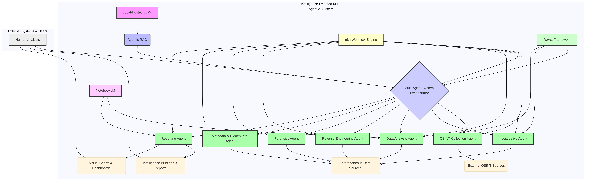

# Architecture Diagrams for the Intelligence-Oriented Multi-Agent AI System

This section provides visual representations of the proposed architecture for the enhanced multi-agent AI system. These diagrams illustrate the key components, their interactions, and the overall flow of information within the system, offering a clear understanding of its design and operational mechanics.

## Overall System Architecture

The following diagram provides a high-level overview of the entire intelligence-oriented multi-agent AI system. It depicts the core components, including the Local-Hosted LLMs, Agentic RAG, the Multi-Agent System Orchestrator, various specialized intelligence agents, and their interactions with external sources and human analysts. The n8n Workflow Engine and NotebookLM are shown as integral tools facilitating orchestration and deep analysis, respectively. The ReAct Framework underpins the adaptive reasoning capabilities of the agents.

