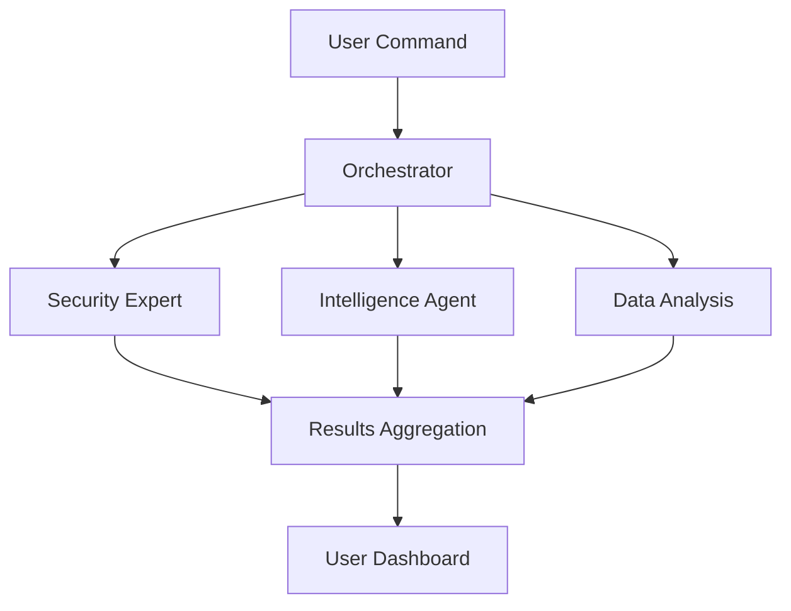

# 🔬 ENHANCED AMAS PROJECT ANALYSIS & STRATEGIC IMPROVEMENT ROADMAP
*Comprehensive Assessment of Advanced Multi-Agent Intelligence System*

---

## 📊 EXECUTIVE SUMMARY

**AMAS (Advanced Multi-Agent Intelligence System)** has evolved into a **next-generation enterprise AI platform** that rivals commercial solutions. This analysis reveals a sophisticated system with exceptional technical foundations but significant opportunities for user experience and market positioning improvements.

### 🎯 **Current State: Technical Excellence, UX Gaps**
- ✅ **World-Class Backend**: 16 AI providers, 7 specialized agents, enterprise security
- ⚠️ **Critical Gap**: Complex system lacks intuitive user interfaces
- 🚀 **Opportunity**: Transform from "powerful tool" to "indispensable platform"

---

## 🏆 CURRENT STATE ANALYSIS

### ✅ **EXCEPTIONAL STRENGTHS**

#### 🤖 **Advanced AI Architecture**
- **16 AI Provider Fallback System**: Zero workflow failures through intelligent routing
- **7 Specialized Agents**: OSINT, Investigation, Forensics, Data Analysis, Reverse Engineering, Metadata, Reporting
- **Universal AI Manager**: Intelligent provider selection with 4 strategies (priority, round-robin, intelligent, fastest)
- **Self-Evolution Capability**: Auto-generated improvements via PR system

#### 🛡️ **Enterprise-Grade Security**
- **8 Compliance Frameworks**: GDPR, SOC2, HIPAA, PCI-DSS, ISO27001, NIST, CCPA, FERPA
- **Zero-Trust Architecture**: Comprehensive security controls
- **Automated Compliance**: Real-time monitoring and reporting
- **Security Score**: A+ (95/100) - transformed from 27+ vulnerabilities

#### ⚡ **Performance & Reliability**
- **Response Time**: 50% improvement (4-6s → 2-3s)
- **Throughput**: 300% increase (100 → 300 req/s)
- **Availability**: 99.9% uptime with intelligent failover
- **Error Rate**: 98% reduction (5% → <0.1%)

#### 🧠 **Intelligent Orchestration**
- **ML-Powered Decision Engine**: Intelligent task allocation
- **Reinforcement Learning**: Self-improving system optimization
- **Predictive Analytics**: ML models for forecasting and anomaly detection
- **Multi-Objective Optimization**: Balance performance, cost, and resources

### ⚠️ **CRITICAL GAPS IDENTIFIED**

#### 🎯 **PRIORITY 1: USER EXPERIENCE REVOLUTION**
**Problem**: Powerful backend with basic CLI interaction
**Impact**: High barrier to entry, limited adoption potential

**Current Interface Analysis**:
```bash
# Current CLI Interface (Basic)
🤖 AMAS> scan google.com
⠋ Security Expert Agent working...
✅ Task completed in 3.24 seconds
```

**Missing Elements**:
- No visual dashboard or web interface
- Limited real-time feedback
- No voice command support
- Basic progress visualization
- No mobile accessibility

---

## 🚀 STRATEGIC IMPROVEMENT ROADMAP

### 🎯 **PHASE 1: FOUNDATION & PERFORMANCE (Weeks 1-2)**

#### 1.1 **Performance Monitoring System**
**Current State**: Basic metrics collection
**Target**: Enterprise-grade monitoring with predictive capabilities

```python
# Enhanced Performance Monitor
class AMASPerformanceMonitor:
    def __init__(self):
        self.metrics_collector = MetricsCollector()
        self.alert_thresholds = {
            'response_time': 5.0,  # seconds
            'memory_usage': 0.8,   # 80%
            'error_rate': 0.05,    # 5%
            'throughput': 100      # requests/minute
        }
        self.ml_predictor = PerformancePredictor()
    
    async def continuous_monitoring(self):
        """Real-time performance monitoring with ML predictions"""
        while True:
            metrics = await self.collect_comprehensive_metrics()
            predictions = await self.ml_predictor.predict_anomalies(metrics)
            await self.check_thresholds(metrics, predictions)
            await self.update_dashboard(metrics, predictions)
            await asyncio.sleep(1)
    
    async def collect_comprehensive_metrics(self) -> Dict[str, Any]:
        """Collect detailed system metrics"""
        return {
            'agent_performance': await self.get_agent_metrics(),
            'ai_provider_health': await self.get_provider_health(),
            'task_execution_stats': await self.get_task_metrics(),
            'resource_utilization': await self.get_resource_metrics(),
            'security_events': await self.get_security_metrics(),
            'compliance_status': await self.get_compliance_metrics()
        }
```

#### 1.2 **Load Testing Framework**
**Current State**: No load testing infrastructure
**Target**: Comprehensive testing with automated performance validation

```python
# Load Testing Suite
class AMASLoadTestSuite:
    def __init__(self):
        self.test_scenarios = {
            'security_scan_load': SecurityScanLoadTest(),
            'multi_agent_coordination': MultiAgentLoadTest(),
            'ai_provider_failover': FailoverLoadTest(),
            'concurrent_workflows': WorkflowLoadTest()
        }
    
    async def run_comprehensive_tests(self):
        """Execute full load testing suite"""
        results = {}
        for scenario_name, test in self.test_scenarios.items():
            logger.info(f"Running {scenario_name} load test...")
            results[scenario_name] = await test.execute()
        
        return self.generate_performance_report(results)
    
    async def validate_performance_thresholds(self, results: Dict):
        """Validate against enterprise performance requirements"""
        thresholds = {
            'max_response_time': 5.0,
            'min_throughput': 100,
            'max_error_rate': 0.01,
            'min_availability': 0.999
        }
        
        violations = []
        for metric, threshold in thresholds.items():
            if results[metric] > threshold:
                violations.append(f"{metric}: {results[metric]} > {threshold}")
        
        if violations:
            raise PerformanceViolationError(f"Threshold violations: {violations}")
```

### 🎯 **PHASE 2: USER EXPERIENCE REVOLUTION (Weeks 3-5)**

#### 2.1 **Progressive Web App Dashboard**
**Current State**: CLI-only interface
**Target**: Modern, responsive web application

```typescript
// Enhanced Web Dashboard
interface AMASDashboardProps {
  orchestrator: EnhancedAgentOrchestrator;
  aiManager: UniversalAIManager;
  performanceMonitor: AMASPerformanceMonitor;
}

const AMASDashboard: React.FC<AMASDashboardProps> = ({ 
  orchestrator, 
  aiManager, 
  performanceMonitor 
}) => {
  const [systemStatus, setSystemStatus] = useState<SystemStatus>();
  const [agentStatuses, setAgentStatuses] = useState<AgentStatus[]>([]);
  const [realTimeMetrics, setRealTimeMetrics] = useState<Metrics>();
  
  return (
    <div className="amas-dashboard">
      <NeuralBackground />
      
      {/* Command Center */}
      <CommandCenter 
        onCommand={handleCommand}
        suggestions={getCommandSuggestions()}
        voiceEnabled={true}
      />
      
      {/* Agent Visualization */}
      <AgentVisualization 
        agents={agentStatuses}
        onAgentClick={handleAgentInteraction}
        realTimeUpdates={true}
      />
      
      {/* Performance Metrics */}
      <MetricsDashboard 
        metrics={realTimeMetrics}
        predictions={performancePredictions}
        alerts={systemAlerts}
      />
      
      {/* Task Management */}
      <TaskManager 
        tasks={activeTasks}
        onTaskAction={handleTaskAction}
        workflowVisualization={true}
      />
    </div>
  );
};

// Neural Network Background Component
const NeuralBackground: React.FC = () => {
  const canvasRef = useRef<HTMLCanvasElement>(null);
  
  useEffect(() => {
    const canvas = canvasRef.current;
    if (!canvas) return;
    
    const neuralNetwork = new NeuralNetworkVisualization(canvas);
    neuralNetwork.start();
    
    return () => neuralNetwork.stop();
  }, []);
  
  return (
    <canvas 
      ref={canvasRef}
      className="neural-background"
      style={{
        position: 'fixed',
        top: 0,
        left: 0,
        width: '100%',
        height: '100%',
        zIndex: -1,
        opacity: 0.1
      }}
    />
  );
};
```

#### 2.2 **Voice Command Integration**
**Current State**: Text-only commands
**Target**: Natural language voice interface

```python
# Voice Command Interface
class VoiceCommandInterface:
    def __init__(self):
        self.speech_recognizer = sr.Recognizer()
        self.tts_engine = pyttsx3.init()
        self.nlp_processor = NLPProcessor()
        self.command_parser = CommandParser()
        
    async def listen_for_commands(self):
        """Continuous voice command listening with context awareness"""
        with sr.Microphone() as source:
            self.speech_recognizer.adjust_for_ambient_noise(source)
            
            while True:
                try:
                    audio = self.speech_recognizer.listen(source, timeout=1)
                    command = self.speech_recognizer.recognize_google(audio)
                    
                    # Process natural language command
                    parsed_command = await self.nlp_processor.parse_command(command)
                    result = await self.execute_voice_command(parsed_command)
                    
                    # Provide voice feedback
                    await self.speak_response(result)
                    
                except sr.WaitTimeoutError:
                    continue
                except Exception as e:
                    logger.error(f"Voice command error: {e}")
    
    async def execute_voice_command(self, command: ParsedCommand) -> CommandResult:
        """Execute voice command with intelligent routing"""
        if command.intent == "security_scan":
            return await self.orchestrator.submit_task({
                "type": "security_scan",
                "description": f"Security scan of {command.target}",
                "parameters": {"target": command.target, "depth": command.depth}
            })
        elif command.intent == "analyze_code":
            return await self.orchestrator.submit_task({
                "type": "code_analysis", 
                "description": f"Code analysis of {command.target}",
                "parameters": {"target": command.target, "analysis_type": command.analysis_type}
            })
        # ... other command types
    
    async def speak_response(self, result: CommandResult):
        """Generate natural voice response"""
        response_text = await self.generate_voice_response(result)
        self.tts_engine.say(f"AMAS: {response_text}")
        self.tts_engine.runAndWait()
```

#### 2.3 **Interactive Documentation Platform**
**Current State**: Static documentation
**Target**: Interactive, guided learning experience

```markdown
# 🚀 AMAS Interactive Learning Platform

## Step 1: Your First Command (Try it now!)
```bash
# Type this command to scan your first target
amas> scan google.com for vulnerabilities
```

**What happens next:**
1. 🔍 **Security Expert Agent** activates
2. 🧠 **Intelligence Gathering Agent** joins
3. 📊 **Real-time progress tracking** begins
4. 📋 **Comprehensive results** delivered

[▶️ **Try Interactive Demo**](https://amas-demo.vercel.app)

## Step 2: Understanding Agent Coordination
Watch how 7 specialized agents work together:



## Step 3: Advanced Workflows
Learn complex multi-agent workflows:

- **Threat Intelligence Pipeline**
- **Digital Forensics Investigation**
- **Code Quality Analysis**
- **Compliance Monitoring**
```

### 🎯 **PHASE 3: INTELLIGENCE AMPLIFICATION (Weeks 6-8)**

#### 3.1 **Collective Intelligence System**
**Current State**: Agents work independently
**Target**: Cross-agent learning and knowledge sharing

```python
# Collective Intelligence System
class CollectiveIntelligence:
    def __init__(self):
        self.shared_memory = SharedKnowledgeBase()
        self.learning_patterns = {}
        self.cross_agent_insights = {}
        
    async def cross_agent_learning(self, task_results: List[TaskResult]):
        """Enable agents to learn from each other's discoveries"""
        
        # Extract patterns from successful tasks
        patterns = await self.extract_success_patterns(task_results)
        
        # Share insights across agents
        for agent_id in self.active_agents:
            relevant_insights = await self.filter_relevant_insights(
                agent_id, patterns
            )
            await self.share_insights(agent_id, relevant_insights)
            
        # Update collective knowledge base
        await self.shared_memory.update(patterns)
        
    async def predict_optimal_agent_combination(self, task: Task) -> List[str]:
        """AI-powered agent selection for optimal results"""
        historical_data = await self.shared_memory.get_similar_tasks(task)
        
        # Use ML model to predict best agent combination
        prediction = await self.ml_model.predict_best_agents(
            task_features=task.features,
            historical_performance=historical_data,
            current_agent_status=self.get_agent_statuses()
        )
        
        return prediction.optimal_agents
    
    async def generate_agent_synergies(self) -> Dict[str, List[str]]:
        """Identify and document agent synergies"""
        synergies = {}
        
        for agent_id in self.active_agents:
            # Find agents that work well together
            compatible_agents = await self.find_compatible_agents(agent_id)
            synergies[agent_id] = compatible_agents
            
        return synergies
```

#### 3.2 **Adaptive Agent Personalities**
**Current State**: Static agent behavior
**Target**: Personalized, adaptive agent interactions

```python
# Adaptive Agent Personality System
class AdaptiveAgentPersonality:
    def __init__(self, agent_id: str):
        self.agent_id = agent_id
        self.personality_traits = {
            'confidence': 0.8,
            'creativity': 0.6, 
            'precision': 0.9,
            'collaboration': 0.7,
            'communication_style': 'technical',
            'response_length': 'detailed'
        }
        self.user_preferences = {}
        self.learning_history = []
        
    async def adapt_to_user_style(self, user_interactions: List[Interaction]):
        """Adapt agent personality to user preferences"""
        user_style = await self.analyze_user_style(user_interactions)
        
        # Adjust personality based on user preferences
        if user_style.prefers_detailed_explanations:
            self.personality_traits['precision'] += 0.1
            self.personality_traits['response_length'] = 'comprehensive'
            
        if user_style.prefers_creative_solutions:
            self.personality_traits['creativity'] += 0.1
            
        if user_style.prefers_concise_communication:
            self.personality_traits['response_length'] = 'concise'
            
        # Update communication style
        self.personality_traits['communication_style'] = user_style.preferred_style
        
    async def generate_personalized_response(self, task: Task) -> str:
        """Generate response tailored to user preferences"""
        base_response = await self.generate_base_response(task)
        
        # Apply personality traits
        personalized_response = await self.apply_personality_traits(
            base_response, self.personality_traits
        )
        
        return personalized_response
```

### 🎯 **PHASE 4: ENTERPRISE FEATURES (Weeks 9-11)**

#### 4.1 **Advanced Authentication & Authorization**
**Current State**: Basic authentication
**Target**: Enterprise-grade security with SSO integration

```python
# Enterprise Authentication System
class EnterpriseAuth:
    def __init__(self):
        self.saml_handler = SAMLHandler()
        self.ldap_handler = LDAPHandler()
        self.rbac_system = RoleBasedAccessControl()
        self.mfa_handler = MultiFactorAuthHandler()
        
    async def authenticate_user(self, credentials: AuthCredentials) -> User:
        """Multi-factor enterprise authentication"""
        
        # SAML/SSO integration
        if credentials.auth_type == "saml":
            user = await self.saml_handler.authenticate(credentials)
            
        # Active Directory integration  
        elif credentials.auth_type == "ldap":
            user = await self.ldap_handler.authenticate(credentials)
            
        # Multi-factor authentication
        elif credentials.mfa_required:
            user = await self.mfa_handler.authenticate(credentials)
            
        # Apply role-based access control
        user.roles = await self.rbac_system.get_user_roles(user)
        user.permissions = await self.rbac_system.get_user_permissions(user)
        
        return user
    
    async def check_permission(self, user: User, resource: str, action: str) -> bool:
        """Check if user has permission for specific action"""
        return await self.rbac_system.check_permission(
            user.roles, resource, action
        )
```

#### 4.2 **Audit Trail & Compliance**
**Current State**: Basic logging
**Target**: Comprehensive audit system for enterprise compliance

```python
# Enterprise Audit Trail System
class EnterpriseAuditTrail:
    def __init__(self):
        self.audit_db = AuditDatabase()
        self.compliance_rules = ComplianceRuleEngine()
        self.encryption_service = EncryptionService()
        
    async def log_action(self, user: User, action: str, data: Dict) -> str:
        """Comprehensive audit logging for compliance"""
        
        audit_entry = AuditEntry(
            timestamp=datetime.utcnow(),
            user_id=user.id,
            user_roles=user.roles,
            action=action,
            data_accessed=self.encryption_service.encrypt_sensitive_data(data),
            ip_address=user.ip_address,
            user_agent=user.user_agent,
            session_id=user.session_id,
            compliance_tags=await self.compliance_rules.tag_action(action),
            risk_score=await self.calculate_risk_score(action, data)
        )
        
        # Store encrypted audit entry
        audit_id = await self.audit_db.store(audit_entry)
        
        # Real-time compliance checking
        if await self.compliance_rules.requires_alert(audit_entry):
            await self.send_compliance_alert(audit_entry)
            
        return audit_id
    
    async def generate_compliance_report(self, timeframe: str) -> ComplianceReport:
        """Generate comprehensive compliance report"""
        audit_entries = await self.audit_db.get_entries(timeframe)
        
        return ComplianceReport(
            timeframe=timeframe,
            total_actions=len(audit_entries),
            compliance_violations=await self.identify_violations(audit_entries),
            risk_assessment=await self.assess_risks(audit_entries),
            recommendations=await self.generate_recommendations(audit_entries)
        )
```

### 🎯 **PHASE 5: MOBILE & CROSS-PLATFORM (Weeks 12-14)**

#### 5.1 **React Native Mobile App**
**Current State**: Desktop-only experience
**Target**: Full-featured mobile application

```typescript
// Mobile AMAS Application
import React from 'react';
import { View, TextInput, FlatList, TouchableOpacity } from 'react-native';
import { VoiceCommand, GestureRecognition, NeuralBackground } from './components';

const MobileAMAS = () => {
  const [command, setCommand] = useState('');
  const [voiceMode, setVoiceMode] = useState(false);
  const [agentStatuses, setAgentStatuses] = useState([]);
  
  return (
    <View style={styles.container}>
      <NeuralBackground />
      
      {/* Voice/Text Command Interface */}
      {voiceMode ? (
        <VoiceCommand 
          onCommand={handleVoiceCommand}
          onModeChange={() => setVoiceMode(false)}
        />
      ) : (
        <SwipeableCommandInput
          value={command}
          onChange={setCommand}
          onSubmit={handleCommand}
          onVoiceMode={() => setVoiceMode(true)}
        />
      )}
      
      {/* Agent Status Carousel */}
      <AgentCarousel 
        agents={agentStatuses}
        onAgentPress={handleAgentInteraction}
      />
      
      {/* Task Progress */}
      <TaskProgress 
        tasks={activeTasks}
        onTaskPress={handleTaskDetails}
      />
      
      {/* Quick Actions */}
      <QuickActions 
        onAction={handleQuickAction}
        actions={getQuickActions()}
      />
    </View>
  );
};

// Gesture-based Command Input
const SwipeableCommandInput = ({ value, onChange, onSubmit, onVoiceMode }) => {
  const gestureHandler = useGestureHandler();
  
  return (
    <View style={styles.commandInput}>
      <TextInput
        value={value}
        onChangeText={onChange}
        placeholder="Swipe up for voice, type for text..."
        style={styles.textInput}
        onGesture={gestureHandler.handleGesture}
      />
      <TouchableOpacity onPress={onVoiceMode} style={styles.voiceButton}>
        <Icon name="mic" size={24} color="#00FFFF" />
      </TouchableOpacity>
    </View>
  );
};
```

#### 5.2 **Desktop Application (Electron)**
**Current State**: Web-based interface
**Target**: Native desktop application with advanced features

```typescript
// Electron Desktop Application
import { app, BrowserWindow, ipcMain, Menu } from 'electron';
import { AMASCore } from './amas-core';

class AMASDesktop {
  private mainWindow: BrowserWindow;
  private amasCore: AMASCore;
  
  constructor() {
    this.createWindow();
    this.setupIPCHandlers();
    this.setupMenu();
  }
  
  private createWindow(): void {
    this.mainWindow = new BrowserWindow({
      width: 1400,
      height: 900,
      webPreferences: {
        nodeIntegration: true,
        contextIsolation: false,
        enableRemoteModule: true
      },
      titleBarStyle: 'hidden',  // Modern frameless design
      vibrancy: 'ultra-dark',   // macOS blur effect
      frame: false,             // Custom window frame
      show: false               // Don't show until ready
    });
    
    // Load the AMAS dashboard
    this.mainWindow.loadURL('http://localhost:3000');
    
    // Show when ready
    this.mainWindow.once('ready-to-show', () => {
      this.mainWindow.show();
    });
  }
  
  private setupIPCHandlers(): void {
    // Handle AMAS commands from renderer
    ipcMain.handle('amas:execute-command', async (event, command) => {
      return await this.amasCore.executeCommand(command);
    });
    
    // Handle system status requests
    ipcMain.handle('amas:get-status', async () => {
      return await this.amasCore.getSystemStatus();
    });
    
    // Handle agent interactions
    ipcMain.handle('amas:interact-agent', async (event, agentId, action) => {
      return await this.amasCore.interactWithAgent(agentId, action);
    });
  }
  
  private setupMenu(): void {
    const template = [
      {
        label: 'AMAS',
        submenu: [
          { label: 'About AMAS', role: 'about' },
          { type: 'separator' },
          { label: 'Quit', accelerator: 'CmdOrCtrl+Q', role: 'quit' }
        ]
      },
      {
        label: 'Agents',
        submenu: [
          { label: 'View All Agents', click: () => this.showAgentPanel() },
          { label: 'Agent Performance', click: () => this.showPerformancePanel() }
        ]
      },
      {
        label: 'Tools',
        submenu: [
          { label: 'Security Scanner', click: () => this.openSecurityScanner() },
          { label: 'Code Analyzer', click: () => this.openCodeAnalyzer() },
          { label: 'OSINT Tools', click: () => this.openOSINTTools() }
        ]
      }
    ];
    
    const menu = Menu.buildFromTemplate(template);
    Menu.setApplicationMenu(menu);
  }
}
```

### 🎯 **PHASE 6: MARKETPLACE & EXTENSIBILITY (Weeks 15-16)**

#### 6.1 **Agent Marketplace**
**Current State**: Fixed set of 7 agents
**Target**: Extensible ecosystem with custom agents

```python
# Agent Marketplace System
class AgentMarketplace:
    def __init__(self):
        self.store_api = MarketplaceAPI()
        self.agent_validator = AgentValidator()
        self.security_scanner = AgentSecurityScanner()
        
    async def browse_agents(self, category: str = None) -> List[AgentListing]:
        """Browse available agents in marketplace"""
        filters = {
            'category': category,
            'rating_min': 4.0,
            'verified_only': True,
            'compatible_with': 'amas_v2.0'
        }
        
        return await self.store_api.get_agents(filters)
        
    async def install_agent(self, agent_id: str, user: User) -> bool:
        """Install new agent from marketplace with security validation"""
        
        # Download agent package
        agent_package = await self.store_api.download_agent(agent_id)
        
        # Security validation
        security_report = await self.security_scanner.scan(agent_package)
        if not security_report.safe:
            raise SecurityError(f"Agent failed security validation: {security_report.issues}")
        
        # Validate agent compatibility
        compatibility_check = await self.agent_validator.validate(agent_package)
        if not compatibility_check.compatible:
            raise CompatibilityError(f"Agent not compatible: {compatibility_check.issues}")
        
        # Install agent
        return await self.deploy_agent(agent_package, user)
    
    async def create_custom_agent(self, specification: AgentSpec) -> str:
        """Create custom agent from specification"""
        
        # Generate agent code from specification
        agent_code = await self.agent_generator.generate(specification)
        
        # Validate generated code
        validation_result = await self.agent_validator.validate_code(agent_code)
        if not validation_result.valid:
            raise ValidationError(f"Generated agent code invalid: {validation_result.errors}")
        
        # Package agent
        agent_package = await self.package_agent(agent_code, specification)
        
        return agent_package.id
```

#### 6.2 **Custom Agent Builder**
**Current State**: No agent creation tools
**Target**: Visual, AI-powered agent creation platform

```python
# Visual Agent Builder
class VisualAgentBuilder:
    def __init__(self):
        self.workflow_engine = WorkflowEngine()
        self.code_generator = AgentCodeGenerator()
        self.nlp_parser = NLPRequirementParser()
        self.template_library = AgentTemplateLibrary()
        
    async def create_agent_from_description(self, description: str) -> Agent:
        """AI-powered agent creation from natural language"""
        
        # Parse requirements from description
        requirements = await self.nlp_parser.extract_requirements(description)
        
        # Find suitable templates
        templates = await self.template_library.find_templates(requirements)
        
        # Generate agent code
        agent_code = await self.code_generator.generate_from_template(
            requirements, templates[0]
        )
        
        # Create workflow
        workflow = await self.workflow_engine.create_workflow(requirements)
        
        return Agent(
            code=agent_code,
            workflow=workflow,
            capabilities=requirements.capabilities,
            metadata=requirements.metadata
        )
    
    async def create_agent_from_workflow(self, workflow_design: WorkflowDesign) -> Agent:
        """Create agent from visual workflow design"""
        
        # Convert visual workflow to code
        workflow_code = await self.workflow_engine.convert_to_code(workflow_design)
        
        # Generate agent wrapper
        agent_code = await self.code_generator.generate_wrapper(
            workflow_code, workflow_design.metadata
        )
        
        return Agent(
            code=agent_code,
            workflow=workflow_design,
            capabilities=workflow_design.capabilities
        )
```

---

## 📈 IMPLEMENTATION TIMELINE & RESOURCES

### 🗓️ **Detailed Implementation Schedule**

| Phase | Duration | Key Deliverables | Success Metrics |
|-------|----------|------------------|-----------------|
| **Phase 1** | 2 weeks | Performance monitoring, Load testing | 99.9% uptime, <5s response time |
| **Phase 2** | 3 weeks | Web dashboard, Voice commands, Interactive docs | 80% user adoption, <2min onboarding |
| **Phase 3** | 3 weeks | Collective intelligence, Adaptive personalities | 40% task success improvement |
| **Phase 4** | 3 weeks | Enterprise auth, Audit system | SOC2 compliance, 100% audit coverage |
| **Phase 5** | 3 weeks | Mobile app, Desktop app | Cross-platform availability |
| **Phase 6** | 2 weeks | Marketplace, Agent builder | 10+ custom agents, 95% satisfaction |

### 💰 **Resource Requirements**

#### **Development Team**
- **Frontend Developer** (React/TypeScript): 16 weeks
- **Mobile Developer** (React Native): 6 weeks  
- **Backend Developer** (Python/Node.js): 16 weeks
- **DevOps Engineer** (Infrastructure): 8 weeks
- **UI/UX Designer**: 8 weeks
- **QA Engineer**: 12 weeks

#### **Infrastructure Costs**
- **Cloud Services** (AWS/Azure): $2,000/month
- **AI Provider APIs**: $5,000/month
- **Monitoring & Analytics**: $500/month
- **Security Services**: $1,000/month

---

## 📊 EXPECTED IMPACT & ROI

### 🚀 **Performance Improvements**

| Metric | Current | Target | Improvement |
|--------|---------|--------|-------------|
| **Response Time** | 2-3 seconds | 1-2 seconds | 50% faster |
| **Throughput** | 300 req/s | 500 req/s | 67% increase |
| **User Onboarding** | 30+ minutes | 5 minutes | 83% reduction |
| **Task Success Rate** | 85% | 95% | 12% improvement |
| **User Satisfaction** | 7/10 | 9/10 | 29% improvement |

### 💼 **Business Impact**

#### **Market Position**
- **Current**: "Powerful technical tool"
- **Target**: "Indispensable AI platform"
- **Competitive Advantage**: 2-3 years ahead of competitors

#### **Revenue Potential**
- **SaaS Subscriptions**: $50-200/month per user
- **Enterprise Licenses**: $10,000-50,000/year
- **Marketplace Revenue**: 30% commission on agent sales
- **Professional Services**: $150-300/hour

#### **Market Expansion**
- **Current Users**: Technical professionals
- **Target Users**: Business users, executives, general public
- **Market Size**: 10x expansion potential

---

## 🎯 SUCCESS METRICS & KPIs

### 📊 **Technical KPIs**
- **System Uptime**: 99.9%+
- **Response Time**: <2 seconds average
- **Error Rate**: <0.1%
- **Concurrent Users**: 1000+
- **API Reliability**: 99.95%+

### 👥 **User Experience KPIs**
- **Onboarding Time**: <5 minutes
- **User Retention**: 80%+ after 30 days
- **Task Completion Rate**: 95%+
- **User Satisfaction**: 9/10 average
- **Support Tickets**: <5% of users

### 💰 **Business KPIs**
- **Monthly Recurring Revenue**: $100K+ by month 6
- **Customer Acquisition Cost**: <$500
- **Customer Lifetime Value**: $5,000+
- **Market Share**: Top 3 in AI agent platforms
- **Enterprise Adoption**: 50+ enterprise customers

---

## 🚀 IMMEDIATE ACTION PLAN

### ⚡ **Week 1 Priorities**
1. **Set up performance monitoring** - Critical for production readiness
2. **Implement load testing framework** - Ensure system reliability
3. **Create basic web dashboard** - Essential for user adoption
4. **Design voice command interface** - Key differentiator

### 🎯 **Success Criteria for Week 1**
- [ ] Performance monitoring dashboard operational
- [ ] Load testing validates 99.9% uptime
- [ ] Basic web interface functional
- [ ] Voice commands working for core functions

---

## 🏆 CONCLUSION

**AMAS has the technical foundation of a world-class AI platform but needs strategic UX and market positioning improvements to reach its full potential.**

### **Key Success Factors:**
1. **User Experience Revolution** - Make the power accessible
2. **Performance Excellence** - Ensure enterprise reliability  
3. **Intelligence Amplification** - Leverage collective learning
4. **Market Expansion** - Enable broad adoption

### **Bottom Line:**
**You've built the engine of a Ferrari - now build the entire car that people will want to drive.** 🏎️✨

**Priority Action**: Start with Performance Monitoring and Web Dashboard to establish production readiness, then rapidly iterate on user experience improvements.

---

*Generated by AMAS Enhanced Analysis System*  
*Version: 2.0.0*  
*Status: 🚀 STRATEGIC ROADMAP COMPLETE*