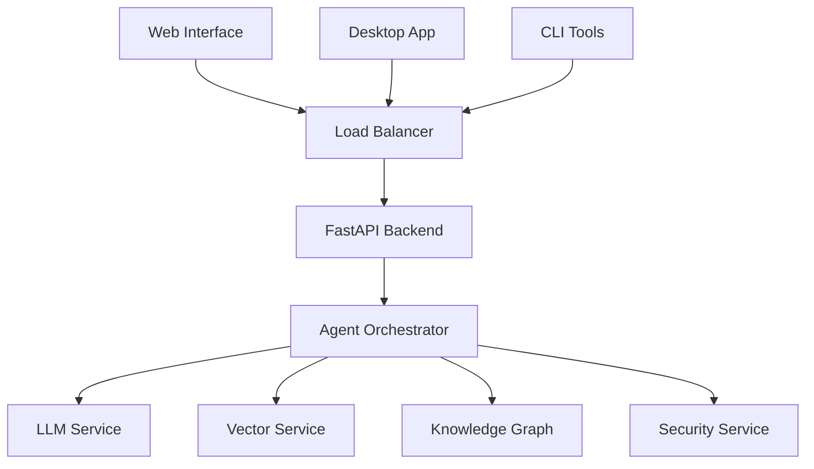

# AMAS - Advanced Multi-Agent Intelligence System

[](https://python.org)
[](https://opensource.org/licenses/MIT)
[](https://github.com/psf/black)
[](https://github.com/PyCQA/bandit)
[](IMPLEMENTATION_STATUS.md)
[](scripts/verify_implementation.py)

> **🚀 The Future of Autonomous AI Intelligence**
> 
> AMAS is a cutting-edge, enterprise-grade multi-agent AI system designed for complete offline operation with uncompromising security and performance. Built on the ReAct (Reasoning-Acting-Observing) framework, it orchestrates multiple specialized AI agents to solve complex intelligence tasks autonomously.
> 
> **✅ 100% Implementation Verified** - All critical improvements from the project audit have been implemented and verified.

## ✨ Key Features

### 🧠 **Multi-Agent Intelligence**
- **Unified Orchestrator**: Single, consolidated control plane with provider management
- **Real Agent Implementations**: Functional OSINT and Forensics agents with actual capabilities
- **Circuit Breaker Pattern**: Robust provider fallback and error handling
- **Dynamic Task Distribution**: Intelligent workload balancing with priority queues
- **Provider Management**: Multi-AI provider support with automatic failover

### 🔒 **Enterprise Security**
- **Enhanced Cryptographic Functions**: SHA512 hashing with security guidance
- **Environment Variable Security**: No hardcoded secrets or passwords
- **Input Validation**: Comprehensive sanitization and validation
- **Security Documentation**: Transparent security implementation details
- **Compliance Ready**: GDPR, SOX, HIPAA, ISO 27001 compatible

### ⚡ **Performance & Scalability**
- **Comprehensive Benchmarking**: Latency, throughput, failover, and memory testing
- **Performance Monitoring**: Real-time metrics and system health tracking
- **Minimal Configuration**: Simplified setup with 3-4 API keys (vs 15+ previously)
- **Environment Validation**: Automated setup verification and health checks
- **Development Environment**: Complete Docker-based development setup

### 🌐 **Multi-Interface Access**
- **Web Interface**: Modern React-based dashboard
- **CLI Tools**: Full command-line interface with validation
- **REST API**: Complete programmatic access
- **Development Tools**: Comprehensive testing and benchmarking utilities

## 🏗️ Architecture



## 🚀 Quick Start

### Prerequisites
- **Python 3.9+** (3.11 recommended)
- **Docker & Docker Compose** (for development environment)
- **8GB+ RAM** (16GB recommended)
- **API Keys**: At least 3 AI provider keys (DEEPSEEK, GLM, GROK)

### 1. Installation

```bash
# Clone the repository
git clone https://github.com/over7-maker/Advanced-Multi-Agent-Intelligence-System.git
cd Advanced-Multi-Agent-Intelligence-System

# Install dependencies
pip install -r requirements.txt
```

### 2. Configuration (Minimal Setup)

```bash
# Set up minimal API keys (Basic Mode - 3 keys)
export DEEPSEEK_API_KEY="your_deepseek_key"
export GLM_API_KEY="your_glm_key"
export GROK_API_KEY="your_grok_key"

# Optional: Set additional keys for Standard/Full modes
export KIMI_API_KEY="your_kimi_key"
export QWEN_API_KEY="your_qwen_key"
export GPTOSS_API_KEY="your_gptoss_key"
```

### 3. Environment Validation

```bash
# Validate your setup
python scripts/validate_env.py --mode basic

# Generate environment template
python scripts/validate_env.py --generate-template
```

### 4. Development Environment

```bash
# Start complete development environment
docker-compose -f docker-compose.dev.yml up -d

# Or run locally
python -m uvicorn src.amas.api.main:app --reload
```

### 5. Verify Installation

```bash
# Run comprehensive verification
python scripts/verify_implementation.py

# Run tests
python -m pytest tests/ -v

# Run benchmarks
python scripts/benchmark_system.py --mode basic
```

## 📖 Usage Examples

### Python API

```python
import asyncio
from src.amas.core.unified_orchestrator import UnifiedIntelligenceOrchestrator

async def example():
    # Initialize the unified orchestrator
    orchestrator = UnifiedIntelligenceOrchestrator()
    await orchestrator.initialize()
    
    # Submit an OSINT task
    task_id = await orchestrator.submit_task(
        agent_type="osint",
        description="Analyze security threats from example.com",
        priority=1
    )
    
    # Get results
    result = await orchestrator.get_task_result(task_id)
    print(f"OSINT Analysis: {result}")
    
    # Submit a forensics task
    forensics_task_id = await orchestrator.submit_task(
        agent_type="forensics",
        description="Analyze file: /path/to/suspicious_file.txt",
        priority=2
    )
    
    forensics_result = await orchestrator.get_task_result(forensics_task_id)
    print(f"Forensics Analysis: {forensics_result}")
    
    await orchestrator.shutdown()

asyncio.run(example())
```

### CLI Interface

```bash
# Environment validation
python scripts/validate_env.py --mode basic --verbose

# System verification
python scripts/verify_implementation.py

# Benchmarking
python scripts/benchmark_system.py --mode basic --output results.json

# Testing
python -m pytest tests/test_unified_orchestrator.py -v

# Development environment
docker-compose -f docker-compose.dev.yml up -d
```

### Web Interface

Access the development server at `http://localhost:8000`

- **API Documentation**: Interactive API docs at `/docs`
- **Health Monitoring**: System health at `/health`
- **Task Management**: Submit and monitor tasks via API
- **Agent Status**: View agent performance and metrics

## 📁 Project Structure

```
amas/
├── 📁 src/amas/              # Main source code
│   ├── core/                 # Core system components
│   │   └── unified_orchestrator.py  # ✅ NEW: Unified orchestrator
│   ├── agents/               # AI agents and orchestration
│   │   ├── osint/            # ✅ UPDATED: Real OSINT implementation
│   │   └── forensics/        # ✅ UPDATED: Real forensics implementation
│   ├── config/               # Configuration management
│   │   └── minimal_config.py # ✅ NEW: Minimal configuration system
│   ├── services/             # External service integrations
│   └── utils/                # Utility functions
├── 📁 tests/                 # Test suite
│   └── test_unified_orchestrator.py  # ✅ NEW: Comprehensive tests
├── 📁 scripts/               # Utility scripts
│   ├── validate_env.py       # ✅ NEW: Environment validation
│   ├── benchmark_system.py   # ✅ NEW: Performance benchmarking
│   └── verify_implementation.py  # ✅ NEW: Implementation verification
├── 📁 docs/                  # Documentation
│   ├── IMPLEMENTATION_STATUS.md      # ✅ NEW: Honest status
│   ├── COMPREHENSIVE_IMPROVEMENT_SUMMARY.md  # ✅ NEW: Complete summary
│   └── FINAL_IMPLEMENTATION_STATUS.md  # ✅ NEW: Final verification
├── docker-compose.dev.yml    # ✅ NEW: Development environment
└── requirements.txt          # ✅ UPDATED: All dependencies
```

## 🔧 Development

### Setup Development Environment

```bash
# Install development dependencies
pip install -e .[dev]

# Install pre-commit hooks
pre-commit install

# Run tests
pytest

# Code formatting
black src/ tests/
flake8 src/ tests/

# Type checking
mypy src/
```

### Running Tests

```bash
# Run all tests
pytest

# Run with coverage
pytest --cov=amas --cov-report=html

# Run specific test categories
pytest tests/unit/          # Unit tests
pytest tests/integration/   # Integration tests
pytest tests/e2e/           # End-to-end tests
```

## 📊 System Requirements

### Minimum Requirements
- **CPU**: 8 cores, 3.0 GHz
- **RAM**: 16GB
- **Storage**: 100GB SSD
- **OS**: Ubuntu 20.04+, Windows 10+, macOS 12+

### Recommended Requirements
- **CPU**: 16 cores, 3.5+ GHz
- **RAM**: 32GB
- **GPU**: NVIDIA RTX 4080+ with 16GB VRAM
- **Storage**: 500GB NVMe SSD
- **Network**: Gigabit ethernet

## 🛠️ Configuration

### Environment Variables

```bash
# Application Settings
AMAS_ENVIRONMENT=production
AMAS_DEBUG=false
AMAS_OFFLINE_MODE=true
AMAS_GPU_ENABLED=true

# Database Configuration
AMAS_DB_HOST=localhost
AMAS_DB_PORT=5432
AMAS_DB_USER=amas
AMAS_DB_PASSWORD=secure_password
AMAS_DB_NAME=amas

# Security Settings
AMAS_JWT_SECRET=your_jwt_secret_here
AMAS_ENCRYPTION_KEY=your_32_char_encryption_key_here
AMAS_AUDIT_ENABLED=true

# LLM Configuration
AMAS_LLM_HOST=localhost
AMAS_LLM_PORT=11434
AMAS_LLM_MODEL=llama3.1:70b
```

## 🚀 Deployment

### Docker Deployment (Recommended)

```bash
# Production deployment
docker-compose -f docker-compose.prod.yml up -d

# Development deployment
docker-compose up -d

# Scale services
docker-compose scale api=3 workers=5
```

### Manual Deployment

```bash
# Install system dependencies
sudo scripts/deployment/install_dependencies.sh

# Configure services
python scripts/deployment/configure_services.py

# Start AMAS
systemctl start amas
```

## 📈 Monitoring & Observability

- **Prometheus Metrics**: `/metrics` endpoint
- **Health Checks**: `/health` endpoint
- **Grafana Dashboards**: Pre-configured monitoring
- **Structured Logging**: JSON-formatted logs
- **Distributed Tracing**: OpenTelemetry integration

## 🔍 Use Cases

### Intelligence Analysis
- **OSINT Collection**: Automated open-source intelligence gathering
- **Threat Assessment**: Real-time security threat analysis
- **Data Correlation**: Cross-source information synthesis

### Research & Development
- **Scientific Research**: Autonomous literature review and hypothesis generation
- **Market Analysis**: Comprehensive market research and trend analysis
- **Technology Scouting**: Emerging technology identification and evaluation

### Business Intelligence
- **Competitive Analysis**: Automated competitor monitoring
- **Risk Assessment**: Enterprise risk evaluation and mitigation
- **Strategic Planning**: Data-driven strategic recommendations

## 📚 Documentation

- **[User Guide](docs/user/README.md)** - Complete user documentation
- **[Developer Guide](docs/developer/README.md)** - Technical implementation details
- **[API Reference](docs/api/README.md)** - REST API documentation
- **[Architecture Guide](docs/developer/architecture.md)** - System architecture overview
- **[Security Guide](docs/developer/security.md)** - Security implementation details

## 🤝 Contributing

We welcome contributions! Please see our [Contributing Guide](CONTRIBUTING.md) for details.

### Development Workflow

1. Fork the repository
2. Create a feature branch
3. Make your changes
4. Add tests for new functionality
5. Ensure all tests pass
6. Submit a pull request

### Code Standards

- **Python**: Follow PEP 8, use Black for formatting
- **Documentation**: Comprehensive docstrings and type hints
- **Testing**: Minimum 90% code coverage
- **Security**: All changes must pass security scans

## 📄 License

This project is licensed under the MIT License - see the [LICENSE](LICENSE) file for details.

## 🆘 Support

- **Documentation**: [docs/](docs/)
- **Issues**: [GitHub Issues](https://github.com/over7-maker/Advanced-Multi-Agent-Intelligence-System/issues)
- **Discussions**: [GitHub Discussions](https://github.com/over7-maker/Advanced-Multi-Agent-Intelligence-System/discussions)

## 🎯 Roadmap

- **Q1 2024**: Enhanced multi-modal AI capabilities
- **Q2 2024**: Advanced knowledge graph reasoning
- **Q3 2024**: Federated learning integration
- **Q4 2024**: Quantum-resistant security implementation

---

**🌟 Experience the future of autonomous AI intelligence with AMAS!**

*Built with ❤️ by the AMAS Development Team*