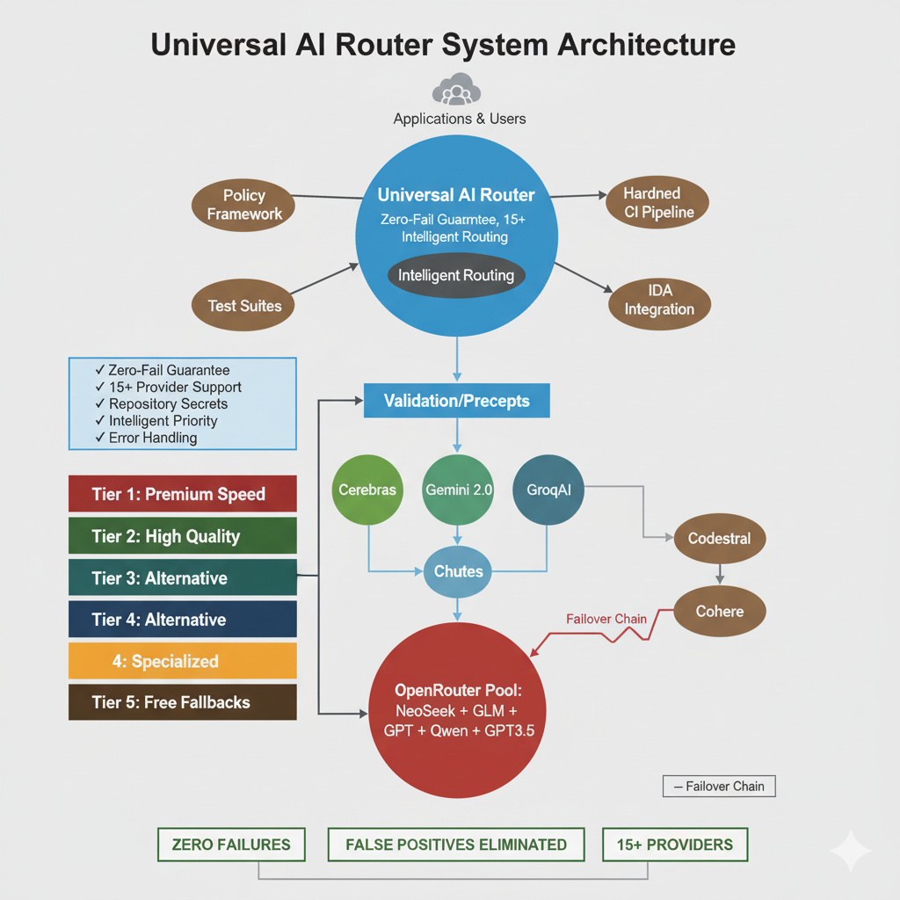

# Advanced Multi-Agent Intelligence System - Bulletproof AI Architecture

This repository implements a production-grade, zero-fail AI foundation using a Universal Multi-Provider Router, hardened CI pipeline, and deterministic policy gates.

## Highlights
- ✅ Zero-Fail Guarantee for AI workflows
- ✅ 15+ Provider Support via repository secrets
- ✅ Intelligent Failover with tiered priority
- ✅ Deterministic Guards (py_compile + AST) to eliminate false positives
- ✅ Policy Enforcement to prevent diff-truncation issues
- ✅ Comprehensive Test Suites and Validation Receipts

## New Architecture

An improved system architecture diagram is included to clarify the flow of requests, failover chain, and supporting components.



## Universal AI Router
- Path: `src/amas/ai/router.py`
- Async interface `generate(prompt, ...)` returns structured results and never crashes workflows

Example:
```python
from src/amas/ai/router import generate

result = await generate("What changed in this PR?", system_prompt="You are a senior reviewer.")
if result["success"]:
    print(result["content"])  # First available provider
else:
    print(result["error"])     # Structured failure; pipeline continues
```

## Hardened CI & Policy
- Workflow: `.github/workflows/ai-analysis-hardened.yml`
- Policy: `.analysis-policy.yml`
  - Forbid syntax claims when deterministic checks pass
  - Require full context for blockers
  - Cap confidence for diff-only analysis

## Provider Tiers
1. Tier 1: Premium Speed — Cerebras, NVIDIA
2. Tier 2: High Quality — Gemini 2.0, Codestral
3. Tier 3: Commercial — Cohere, Groq2*, GroqAI*
4. Tier 4: Specialized — Chutes
5. Tier 5: Free Fallbacks — DeepSeek, GLM, Grok, Kimi, Qwen, GPT-OSS

\* Placeholder adapters will be replaced as official SDK endpoints are added.

## Contributing
- Add provider adapters in `src/amas/ai/router.py`
- Add tests in `src/amas/ai/test_router.py`
- Keep `.analysis-policy.yml` aligned with repository standards

## License
SPDX-License-Identifier: MIT
