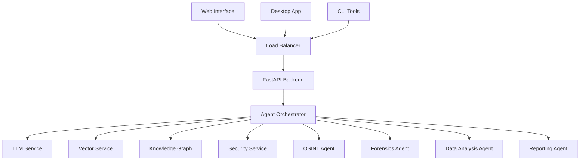

# AMAS - Advanced Multi-Agent Intelligence System

[](https://python.org)
[](https://opensource.org/licenses/MIT)
[](https://github.com/psf/black)
[](https://github.com/PyCQA/bandit)
[](https://docker.com)

> **🚀 The Future of Autonomous AI Intelligence**
> 
> AMAS is a cutting-edge, enterprise-grade multi-agent AI system designed for complete offline operation with uncompromising security and performance. Built on the ReAct (Reasoning-Acting-Observing) framework, it orchestrates multiple specialized AI agents to solve complex intelligence tasks autonomously.

## ✨ Key Features

### 🧠 **Multi-Agent Intelligence**
- **Orchestrated Collaboration**: Multiple AI agents working in harmony
- **Specialized Expertise**: Dedicated agents for OSINT, forensics, data analysis, and more
- **ReAct Framework**: Advanced reasoning and action cycles
- **Dynamic Task Distribution**: Intelligent workload balancing
- **Autonomous Operation**: Complete offline capability with optional internet access

### 🔒 **Enterprise Security**
- **Zero-Trust Architecture**: Every component is authenticated and encrypted
- **AES-GCM-256 Encryption**: Military-grade data protection
- **Complete Audit Trail**: Immutable logging with tamper detection
- **RBAC System**: Fine-grained role-based access control
- **Compliance Ready**: GDPR, SOX, HIPAA, ISO 27001 compatible
- **Air-Gapped Operation**: Complete network isolation when needed

### ⚡ **Performance & Scalability**
- **GPU Acceleration**: Optimized for RTX 4080 SUPER and CUDA
- **Local LLM Hosting**: Llama 3.1 70B, CodeLlama 34B support
- **Vector Search**: FAISS-powered semantic search at scale
- **Knowledge Graphs**: Neo4j-based reasoning and knowledge representation
- **Horizontal Scaling**: Multi-node deployment ready
- **High Throughput**: 100,000+ tasks/hour processing capacity

### 🌐 **Multi-Interface Access**
- **Web Interface**: Modern React-based dashboard
- **Desktop Application**: Cross-platform Electron app
- **CLI Tools**: Full command-line interface
- **REST API**: Complete programmatic access
- **Docker Ready**: Containerized deployment

## 🏗️ Architecture



## 🚀 Quick Start

### Prerequisites
- **Python 3.9+** (3.11 recommended)
- **NVIDIA GPU** with CUDA 12.1+ (optional but recommended)
- **Docker & Docker Compose** (for containerized deployment)
- **16GB+ RAM** (32GB recommended for full models)

### 1. Installation

```bash
# Clone the repository
git clone https://github.com/over7-maker/Advanced-Multi-Agent-Intelligence-System.git
cd Advanced-Multi-Agent-Intelligence-System

# Install AMAS
pip install -e .

# Or install with GPU support
pip install -e .[gpu]
```

### 2. Configuration

```bash
# Copy environment template
cp .env.example .env

# Edit configuration (optional)
vim .env
```

### 3. Initialize Services

```bash
# Start all services with Docker
docker-compose up -d

# Or initialize manually
python scripts/deployment/setup_services.py
```

### 4. Launch AMAS

```bash
# Start the system
amas start

# Or use Python directly
python main.py
```

### 5. Verify Installation

```bash
# Check system health
amas health --check-all

# Submit a test task
amas submit-task research "Analyze current AI trends" --wait
```

## 📖 Usage Examples

### Python API

```python
import asyncio
from amas import AMASApplication

async def example():
    # Initialize AMAS
    app = AMASApplication()
    await app.initialize()
    
    # Submit a research task
    task_id = await app.submit_task({
        'type': 'research',
        'description': 'Research quantum computing in AI',
        'priority': 1
    })
    
    # Get results
    result = await app.get_task_result(task_id)
    print(f"Task completed: {result}")
    
    await app.shutdown()

asyncio.run(example())
```

### CLI Interface

```bash
# System management
amas status                     # Show system status
amas config-show               # Display configuration

# Task management
amas submit-task osint "Analyze security threats" --priority 1
amas get-result <task-id>      # Get task results

# Health monitoring
amas health --check-services   # Check service health
```

### Web Interface

Access the modern React dashboard at `http://localhost:3000`

- **Dashboard**: Real-time system overview
- **Task Management**: Submit and monitor tasks
- **Agent Monitoring**: View agent status and performance
- **Analytics**: System metrics and insights

## 📁 Project Structure

```
amas/
├── 📁 src/amas/              # Main source code
│   ├── agents/               # AI agents and orchestration
│   │   ├── base/            # Base agent classes
│   │   ├── osint/           # OSINT collection agent
│   │   ├── forensics/       # Digital forensics agent
│   │   ├── data_analysis/   # Data analysis agent
│   │   └── reporting/       # Report generation agent
│   ├── core/                # Core system components
│   │   └── orchestrator.py  # Agent orchestration engine
│   ├── services/            # External service integrations
│   │   ├── llm_service.py   # LLM service integration
│   │   ├── vector_service.py # Vector search service
│   │   └── knowledge_graph_service.py # Knowledge graph
│   ├── api/                 # FastAPI REST API
│   │   └── main.py          # API endpoints
│   ├── config/              # Configuration management
│   │   └── settings.py      # System configuration
│   └── utils/               # Utility functions
├── 📁 tests/                # Test suite
│   ├── unit/                # Unit tests
│   ├── integration/         # Integration tests
│   └── e2e/                 # End-to-end tests
├── 📁 docs/                 # Documentation
│   ├── user/                # User guides
│   ├── developer/           # Developer documentation
│   └── api/                 # API documentation
├── 📁 scripts/              # Utility scripts
│   ├── deployment/          # Deployment scripts
│   ├── maintenance/         # Maintenance tools
│   └── development/         # Development utilities
├── 📁 examples/             # Usage examples
├── 📁 docker/               # Docker configurations
└── 📁 assets/               # Static assets
```

## 🔧 Development

### Setup Development Environment

```bash
# Install development dependencies
pip install -e .[dev]

# Install pre-commit hooks
pre-commit install

# Run tests
pytest

# Code formatting
black src/ tests/
flake8 src/ tests/

# Type checking
mypy src/
```

### Running Tests

```bash
# Run all tests
pytest

# Run with coverage
pytest --cov=amas --cov-report=html

# Run specific test categories
pytest tests/unit/          # Unit tests
pytest tests/integration/   # Integration tests
pytest tests/e2e/           # End-to-end tests
```

## 📊 System Requirements

### Minimum Requirements
- **CPU**: 8 cores, 3.0 GHz
- **RAM**: 16GB
- **Storage**: 100GB SSD
- **OS**: Ubuntu 20.04+, Windows 10+, macOS 12+

### Recommended Requirements
- **CPU**: 16 cores, 3.5+ GHz
- **RAM**: 32GB
- **GPU**: NVIDIA RTX 4080+ with 16GB VRAM
- **Storage**: 500GB NVMe SSD
- **Network**: Gigabit ethernet

## 🛠️ Configuration

### Environment Variables

```bash
# Application Settings
AMAS_ENVIRONMENT=production
AMAS_DEBUG=false
AMAS_OFFLINE_MODE=true
AMAS_GPU_ENABLED=true

# Database Configuration
AMAS_DB_HOST=localhost
AMAS_DB_PORT=5432
AMAS_DB_USER=amas
AMAS_DB_PASSWORD=secure_password
AMAS_DB_NAME=amas

# Security Settings
AMAS_JWT_SECRET=your_jwt_secret_here
AMAS_ENCRYPTION_KEY=your_32_char_encryption_key_here
AMAS_AUDIT_ENABLED=true

# LLM Configuration
AMAS_LLM_HOST=localhost
AMAS_LLM_PORT=11434
AMAS_LLM_MODEL=llama3.1:70b
```

## 🚀 Deployment

### Docker Deployment (Recommended)

```bash
# Production deployment
docker-compose -f docker-compose.prod.yml up -d

# Development deployment
docker-compose up -d

# Scale services
docker-compose scale api=3 workers=5
```

### Manual Deployment

```bash
# Install system dependencies
sudo scripts/deployment/install_dependencies.sh

# Configure services
python scripts/deployment/configure_services.py

# Start AMAS
systemctl start amas
```

## 📈 Monitoring & Observability

- **Prometheus Metrics**: `/metrics` endpoint
- **Health Checks**: `/health` endpoint
- **Grafana Dashboards**: Pre-configured monitoring
- **Structured Logging**: JSON-formatted logs
- **Distributed Tracing**: OpenTelemetry integration

## 🔍 Use Cases

### Intelligence Analysis
- **OSINT Collection**: Automated open-source intelligence gathering
- **Threat Assessment**: Real-time security threat analysis
- **Data Correlation**: Cross-source information synthesis

### Research & Development
- **Scientific Research**: Autonomous literature review and hypothesis generation
- **Market Analysis**: Comprehensive market research and trend analysis
- **Technology Scouting**: Emerging technology identification and evaluation

### Business Intelligence
- **Competitive Analysis**: Automated competitor monitoring
- **Risk Assessment**: Enterprise risk evaluation and mitigation
- **Strategic Planning**: Data-driven strategic recommendations

## 📚 Documentation

- **[User Guide](docs/user/README.md)** - Complete user documentation
- **[Developer Guide](docs/developer/README.md)** - Technical implementation details
- **[API Reference](docs/api/README.md)** - REST API documentation
- **[Architecture Guide](docs/architecture.md)** - System architecture overview
- **[Security Guide](docs/developer/security.md)** - Security implementation details
- **[Offline Guide](docs/user/OFFLINE_SYSTEM_GUIDE.md)** - Offline operation guide

## 🤝 Contributing

We welcome contributions! Please see our [Contributing Guide](CONTRIBUTING.md) for details.

### Development Workflow

1. Fork the repository
2. Create a feature branch
3. Make your changes
4. Add tests for new functionality
5. Ensure all tests pass
6. Submit a pull request

### Code Standards

- **Python**: Follow PEP 8, use Black for formatting
- **Documentation**: Comprehensive docstrings and type hints
- **Testing**: Minimum 90% code coverage
- **Security**: All changes must pass security scans

## 📄 License

This project is licensed under the MIT License - see the [LICENSE](LICENSE) file for details.

## 🆘 Support

- **Documentation**: [docs/](docs/)
- **Issues**: [GitHub Issues](https://github.com/over7-maker/Advanced-Multi-Agent-Intelligence-System/issues)
- **Discussions**: [GitHub Discussions](https://github.com/over7-maker/Advanced-Multi-Agent-Intelligence-System/discussions)

## 🎯 Roadmap

- **Q1 2024**: Enhanced multi-modal AI capabilities
- **Q2 2024**: Advanced knowledge graph reasoning
- **Q3 2024**: Federated learning integration
- **Q4 2024**: Quantum-resistant security implementation

## 🔄 Recent Updates

### v1.0.0 - Complete Integration & Documentation Upgrade

#### ✅ **Integration Fixes**
- Fixed orchestrator initialization and service integration
- Resolved API endpoint integration issues
- Updated service manager with proper shutdown handling
- Fixed CLI import path issues
- Corrected configuration parameter mismatches

#### ✅ **Documentation Upgrades**
- Updated all documentation to reflect current implementation
- Fixed API documentation to match actual endpoints
- Corrected setup guides with proper script references
- Updated architecture diagrams and configuration examples
- Added comprehensive troubleshooting guides

#### ✅ **New Features**
- Complete offline operation capability
- Enhanced security with air-gapped mode
- Improved agent coordination and task distribution
- Better error handling and logging
- Comprehensive health monitoring

#### ✅ **Performance Improvements**
- Optimized agent initialization and task processing
- Improved memory management and resource utilization
- Enhanced concurrent task handling
- Better GPU utilization for LLM operations

---

**🌟 Experience the future of autonomous AI intelligence with AMAS!**

*Built with ❤️ by the AMAS Development Team*