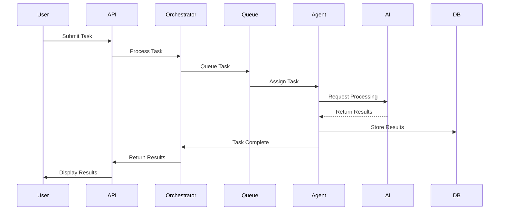

# 🏗️ AMAS Architecture Documentation

## Overview

The Advanced Multi-Agent Intelligence System (AMAS) is built on a modern, scalable microservices architecture designed for enterprise deployment. This document provides a comprehensive overview of the system architecture, design decisions, and technical implementation details.

## 📋 Table of Contents

1. [System Overview](#system-overview)
2. [Core Architecture](#core-architecture)
3. [Component Architecture](#component-architecture)
4. [Data Architecture](#data-architecture)
5. [Security Architecture](#security-architecture)
6. [Integration Architecture](#integration-architecture)
7. [Deployment Architecture](#deployment-architecture)
8. [Performance Architecture](#performance-architecture)
9. [Scalability Design](#scalability-design)
10. [Technology Stack](#technology-stack)

---

## 🌐 System Overview

### High-Level Architecture

```
┌─────────────────────────────────────────────────────────────────────────┐
│                              AMAS Platform                               │
├─────────────────────────────────────────────────────────────────────────┤
│                           Presentation Layer                             │
│  ┌─────────────┐  ┌─────────────┐  ┌─────────────┐  ┌─────────────┐  │
│  │   Web UI    │  │   Mobile    │  │     CLI     │  │     API     │  │
│  │  (React)    │  │    Apps     │  │   (Rich)    │  │  (FastAPI)  │  │
│  └─────────────┘  └─────────────┘  └─────────────┘  └─────────────┘  │
├─────────────────────────────────────────────────────────────────────────┤
│                          Application Layer                               │
│  ┌───────────────────────────────────────────────────────────────┐     │
│  │                    Agent Orchestrator                          │     │
│  ├─────────────────┬─────────────────┬─────────────────────────┤     │
│  │   Task Queue    │ Workflow Engine │   Event Dispatcher      │     │
│  │   (Celery)      │  (Prefect)     │   (EventBus)           │     │
│  └─────────────────┴─────────────────┴─────────────────────────┘     │
├─────────────────────────────────────────────────────────────────────────┤
│                            Agent Layer                                   │
│  ┌──────────┐  ┌──────────┐  ┌──────────┐  ┌──────────┐  ┌─────────┐ │
│  │  OSINT   │  │ Security │  │ Analysis │  │Forensics │  │   ML    │ │
│  │  Agent   │  │  Agent   │  │  Agent   │  │  Agent   │  │ Agent   │ │
│  └──────────┘  └──────────┘  └──────────┘  └──────────┘  └─────────┘ │
├─────────────────────────────────────────────────────────────────────────┤
│                           Service Layer                                  │
│  ┌─────────────┐  ┌─────────────┐  ┌─────────────┐  ┌─────────────┐  │
│  │ AI Manager  │  │ML Decision  │  │ Monitoring  │  │  Security   │  │
│  │(16 Providers)│ │   Engine    │  │  Service    │  │  Service    │  │
│  └─────────────┘  └─────────────┘  └─────────────┘  └─────────────┘  │
├─────────────────────────────────────────────────────────────────────────┤
│                            Data Layer                                    │
│  ┌──────────┐  ┌──────────┐  ┌──────────┐  ┌──────────┐  ┌─────────┐ │
│  │PostgreSQL│  │  Redis   │  │  FAISS   │  │  Neo4j   │  │   S3    │ │
│  │   (SQL)  │  │ (Cache)  │  │ (Vector) │  │ (Graph)  │  │(Storage)│ │
│  └──────────┘  └──────────┘  └──────────┘  └──────────┘  └─────────┘ │
└─────────────────────────────────────────────────────────────────────────┘
```

### Design Principles

1. **Microservices Architecture**: Loosely coupled, independently deployable services
2. **Event-Driven Design**: Asynchronous communication via event bus
3. **Domain-Driven Design (DDD)**: Clear boundaries between business domains
4. **SOLID Principles**: Single responsibility, open/closed, etc.
5. **12-Factor App**: Environment-based configuration, stateless processes
6. **Cloud-Native**: Container-first, orchestration-ready
7. **API-First**: All functionality exposed via well-defined APIs

---

## 🎯 Core Architecture

### Component Interaction Flow



### Key Architectural Patterns

#### 1. Agent-Based Architecture
```python
# Agent abstraction
class BaseAgent(ABC):
    """Base class for all agents."""
    
    @abstractmethod
    async def execute(self, task: Task) -> TaskResult:
        """Execute agent-specific task."""
        pass
    
    @abstractmethod
    def get_capabilities(self) -> List[Capability]:
        """Return agent capabilities."""
        pass
```

#### 2. Event Sourcing
```python
# Event sourcing for audit trail
class EventStore:
    """Store and replay events."""
    
    async def append(self, event: Event):
        """Append event to store."""
        await self.db.insert_event(event)
        await self.event_bus.publish(event)
    
    async def replay(self, aggregate_id: str) -> List[Event]:
        """Replay events for aggregate."""
        return await self.db.get_events(aggregate_id)
```

#### 3. CQRS (Command Query Responsibility Segregation)
```python
# Separate read and write models
class CommandHandler:
    """Handle write operations."""
    async def create_task(self, command: CreateTaskCommand) -> str:
        # Business logic
        task = Task.from_command(command)
        await self.repository.save(task)
        return task.id

class QueryHandler:
    """Handle read operations."""
    async def get_task_status(self, task_id: str) -> TaskStatus:
        # Optimized read path
        return await self.read_model.get_status(task_id)
```

---

## 🔧 Component Architecture

### 1. Agent Orchestrator

The orchestrator is the brain of AMAS, coordinating all agent activities.

```python
class AgentOrchestrator:
    """Central coordination component."""
    
    def __init__(self):
        self.agents = AgentRegistry()
        self.scheduler = TaskScheduler()
        self.monitor = PerformanceMonitor()
        self.ml_engine = MLDecisionEngine()
    
    async def execute_task(self, task: Task) -> TaskResult:
        # ML-based agent selection
        agents = await self.ml_engine.select_agents(task)
        
        # Create execution plan
        plan = self.create_execution_plan(task, agents)
        
        # Execute with monitoring
        with self.monitor.track_execution(task.id):
            results = await self.execute_plan(plan)
        
        return self.aggregate_results(results)
```

### 2. Universal AI Manager

Manages 16 AI providers with intelligent fallback and load balancing.

```python
class UniversalAIManager:
    """Multi-provider AI management."""
    
    PROVIDERS = [
        DeepSeekProvider(priority=1),
        GLMProvider(priority=2),
        GrokProvider(priority=3),
        # ... 13 more providers
    ]
    
    async def generate(self, prompt: str, **kwargs) -> AIResponse:
        strategy = self.select_strategy(kwargs.get('strategy', 'intelligent'))
        
        for provider in strategy.get_providers():
            try:
                if self.circuit_breaker.is_open(provider):
                    continue
                    
                response = await provider.generate(prompt, **kwargs)
                self.metrics.record_success(provider)
                return response
                
            except Exception as e:
                self.metrics.record_failure(provider, e)
                self.circuit_breaker.record_failure(provider)
                
        raise AllProvidersFailedError("No providers available")
```

### 3. ML Decision Engine

Intelligent task allocation using machine learning.

```python
class MLDecisionEngine:
    """ML-powered decision making."""
    
    def __init__(self):
        self.model = self.load_model()
        self.feature_extractor = FeatureExtractor()
        self.historical_data = HistoricalDataStore()
    
    async def select_agents(self, task: Task) -> List[Agent]:
        # Extract features
        features = self.feature_extractor.extract(
            task=task,
            historical_performance=await self.get_historical_performance(),
            current_load=await self.get_system_load()
        )
        
        # Predict optimal allocation
        predictions = self.model.predict(features)
        
        # Multi-objective optimization
        allocation = self.optimize_allocation(
            predictions,
            objectives=['performance', 'cost', 'reliability']
        )
        
        return allocation.get_agents()
```

### 4. Service Manager

Manages the lifecycle of all system services.

```python
class ServiceManager:
    """Service lifecycle management."""
    
    def __init__(self):
        self.services: Dict[str, Service] = {}
        self.health_checker = HealthChecker()
        self.dependency_graph = DependencyGraph()
    
    async def start_services(self):
        # Start in dependency order
        start_order = self.dependency_graph.topological_sort()
        
        for service_name in start_order:
            service = self.services[service_name]
            await self.start_service(service)
    
    async def start_service(self, service: Service):
        # Check dependencies
        for dep in service.dependencies:
            if not await self.health_checker.is_healthy(dep):
                raise DependencyError(f"{dep} is not healthy")
        
        # Start service
        await service.start()
        
        # Wait for health
        await self.health_checker.wait_for_health(service.name)
```

---

## 💾 Data Architecture

### Data Flow Diagram

```
┌─────────────────────────────────────────────────────────────┐
│                       Data Sources                          │
│  ┌─────────┐  ┌─────────┐  ┌─────────┐  ┌─────────┐      │
│  │  APIs   │  │  Files  │  │Databases│  │ Streams │      │
│  └────┬────┘  └────┬────┘  └────┬────┘  └────┬────┘      │
│       └────────────┴────────────┴────────────┘            │
│                           │                                 │
│                    ┌──────▼──────┐                        │
│                    │ Data Ingestion│                       │
│                    │    Layer     │                        │
│                    └──────┬──────┘                        │
│                           │                                 │
│       ┌───────────────────┼───────────────────┐           │
│       │                   │                   │           │
│  ┌────▼────┐       ┌─────▼─────┐      ┌─────▼─────┐     │
│  │ Transform│       │  Validate │      │  Enrich   │     │
│  │  (ETL)  │       │   (DQM)   │      │  (ML/AI)  │     │
│  └────┬────┘       └─────┬─────┘      └─────┬─────┘     │
│       └───────────────────┼───────────────────┘           │
│                           │                                 │
│                    ┌──────▼──────┐                        │
│                    │ Data Storage │                        │
│                    │    Layer     │                        │
│                    └──────────────┘                        │
└─────────────────────────────────────────────────────────────┘
```

### Database Design

#### Primary Database (PostgreSQL)
```sql
-- Core schema
CREATE SCHEMA amas;

-- Tasks table
CREATE TABLE amas.tasks (
    id UUID PRIMARY KEY DEFAULT gen_random_uuid(),
    task_type VARCHAR(50) NOT NULL,
    status VARCHAR(20) NOT NULL,
    parameters JSONB NOT NULL,
    created_at TIMESTAMP WITH TIME ZONE DEFAULT NOW(),
    updated_at TIMESTAMP WITH TIME ZONE DEFAULT NOW(),
    completed_at TIMESTAMP WITH TIME ZONE,
    created_by UUID REFERENCES amas.users(id),
    assigned_agents TEXT[],
    priority INTEGER DEFAULT 5,
    metadata JSONB DEFAULT '{}'::jsonb
);

-- Results table
CREATE TABLE amas.results (
    id UUID PRIMARY KEY DEFAULT gen_random_uuid(),
    task_id UUID REFERENCES amas.tasks(id),
    agent_id VARCHAR(50) NOT NULL,
    status VARCHAR(20) NOT NULL,
    data JSONB NOT NULL,
    created_at TIMESTAMP WITH TIME ZONE DEFAULT NOW(),
    processing_time_ms INTEGER,
    error_message TEXT
);

-- Audit log
CREATE TABLE amas.audit_log (
    id BIGSERIAL PRIMARY KEY,
    event_type VARCHAR(50) NOT NULL,
    entity_type VARCHAR(50) NOT NULL,
    entity_id UUID NOT NULL,
    user_id UUID,
    changes JSONB,
    ip_address INET,
    user_agent TEXT,
    created_at TIMESTAMP WITH TIME ZONE DEFAULT NOW()
);

-- Indexes for performance
CREATE INDEX idx_tasks_status ON amas.tasks(status);
CREATE INDEX idx_tasks_created_at ON amas.tasks(created_at DESC);
CREATE INDEX idx_results_task_id ON amas.results(task_id);
CREATE INDEX idx_audit_log_entity ON amas.audit_log(entity_type, entity_id);
```

#### Cache Layer (Redis)
```python
# Cache strategy
class CacheStrategy:
    """Multi-level caching strategy."""
    
    # L1: Local memory cache (5 minutes)
    local_cache = TTLCache(maxsize=1000, ttl=300)
    
    # L2: Redis cache (1 hour)
    redis_cache = Redis(
        host='redis',
        decode_responses=True,
        socket_keepalive=True
    )
    
    # L3: Database (persistent)
    
    async def get(self, key: str) -> Optional[Any]:
        # Try L1
        if key in self.local_cache:
            return self.local_cache[key]
        
        # Try L2
        value = await self.redis_cache.get(key)
        if value:
            self.local_cache[key] = value
            return value
        
        # L3 - fetch from database
        return None
```

#### Vector Database (FAISS)
```python
# Vector storage for ML embeddings
class VectorStore:
    """FAISS-based vector storage."""
    
    def __init__(self, dimension: int = 768):
        self.index = faiss.IndexFlatL2(dimension)
        self.id_map = {}
    
    def add_embeddings(self, embeddings: np.ndarray, ids: List[str]):
        """Add embeddings to index."""
        self.index.add(embeddings)
        for i, id in enumerate(ids):
            self.id_map[len(self.id_map)] = id
    
    def search(self, query: np.ndarray, k: int = 10) -> List[Tuple[str, float]]:
        """Search similar embeddings."""
        distances, indices = self.index.search(query, k)
        results = []
        for i, idx in enumerate(indices[0]):
            if idx != -1:
                results.append((self.id_map[idx], distances[0][i]))
        return results
```

---

## 🔒 Security Architecture

### Security Layers

```
┌─────────────────────────────────────────────────────────────┐
│                    Perimeter Security                        │
│  ┌─────────────┐  ┌─────────────┐  ┌─────────────┐        │
│  │    WAF      │  │   DDoS      │  │   Geo       │        │
│  │ Protection  │  │ Protection  │  │  Blocking   │        │
│  └─────────────┘  └─────────────┘  └─────────────┘        │
├─────────────────────────────────────────────────────────────┤
│                    Network Security                          │
│  ┌─────────────┐  ┌─────────────┐  ┌─────────────┐        │
│  │  Firewall   │  │   IDS/IPS   │  │   VPN/TLS   │        │
│  └─────────────┘  └─────────────┘  └─────────────┘        │
├─────────────────────────────────────────────────────────────┤
│                  Application Security                        │
│  ┌─────────────┐  ┌─────────────┐  ┌─────────────┐        │
│  │    Auth     │  │    RBAC     │  │   Input     │        │
│  │   & MFA     │  │   & ACL     │  │ Validation  │        │
│  └─────────────┘  └─────────────┘  └─────────────┘        │
├─────────────────────────────────────────────────────────────┤
│                     Data Security                            │
│  ┌─────────────┐  ┌─────────────┐  ┌─────────────┐        │
│  │ Encryption  │  │   Masking   │  │   Audit     │        │
│  │  at Rest    │  │ & Redaction │  │   Trail     │        │
│  └─────────────┘  └─────────────┘  └─────────────┘        │
└─────────────────────────────────────────────────────────────┘
```

### Zero-Trust Implementation

```python
class ZeroTrustGateway:
    """Zero-trust security gateway."""
    
    async def authenticate_request(self, request: Request) -> AuthContext:
        # Multi-factor verification
        auth_factors = []
        
        # 1. API Key/Token
        token = await self.verify_token(request)
        auth_factors.append(TokenFactor(token))
        
        # 2. Device fingerprint
        device = await self.verify_device(request)
        auth_factors.append(DeviceFactor(device))
        
        # 3. Behavioral analysis
        behavior = await self.analyze_behavior(request)
        auth_factors.append(BehaviorFactor(behavior))
        
        # 4. Context verification
        context = await self.verify_context(request)
        auth_factors.append(ContextFactor(context))
        
        # Calculate trust score
        trust_score = self.calculate_trust_score(auth_factors)
        
        if trust_score < self.minimum_trust_threshold:
            raise InsufficientTrustError("Request does not meet trust requirements")
        
        return AuthContext(
            user=token.user,
            trust_score=trust_score,
            factors=auth_factors
        )
```

---

## 🔗 Integration Architecture

### API Gateway Pattern

```
┌─────────────────────────────────────────────────────────────┐
│                      API Gateway                            │
├─────────────────────────────────────────────────────────────┤
│  ┌─────────────┐  ┌─────────────┐  ┌─────────────┐        │
│  │   Routing   │  │    Auth     │  │   Rate      │        │
│  │             │  │             │  │  Limiting   │        │
│  └──────┬──────┘  └──────┬──────┘  └──────┬──────┘        │
│         └─────────────────┼─────────────────┘              │
│                           │                                  │
│         ┌─────────────────┼─────────────────┐              │
│         │                 │                 │              │
│    ┌────▼────┐      ┌────▼────┐      ┌────▼────┐         │
│    │ Service │      │ Service │      │ Service │         │
│    │    A    │      │    B    │      │    C    │         │
│    └─────────┘      └─────────┘      └─────────┘         │
└─────────────────────────────────────────────────────────────┘
```

### Integration Patterns

#### 1. Webhook Integration
```python
class WebhookManager:
    """Manage webhook integrations."""
    
    async def register_webhook(self, config: WebhookConfig) -> str:
        webhook = Webhook(
            url=config.url,
            events=config.events,
            secret=self.generate_secret(),
            retry_policy=config.retry_policy
        )
        
        await self.store.save_webhook(webhook)
        return webhook.id
    
    async def trigger_webhook(self, event: Event):
        webhooks = await self.store.get_webhooks_for_event(event.type)
        
        for webhook in webhooks:
            payload = self.create_payload(event, webhook)
            signature = self.sign_payload(payload, webhook.secret)
            
            await self.queue.enqueue(
                WebhookDeliveryTask(
                    webhook=webhook,
                    payload=payload,
                    signature=signature
                )
            )
```

#### 2. Message Queue Integration
```python
class MessageQueueIntegration:
    """RabbitMQ/Kafka integration."""
    
    def __init__(self):
        self.producers = {}
        self.consumers = {}
    
    async def publish(self, topic: str, message: Message):
        producer = self.get_producer(topic)
        
        await producer.send(
            topic=topic,
            value=message.to_json(),
            headers=message.headers
        )
    
    async def subscribe(self, topic: str, handler: Callable):
        consumer = self.get_consumer(topic)
        
        async for message in consumer:
            try:
                await handler(Message.from_json(message.value))
                await consumer.commit()
            except Exception as e:
                await self.handle_error(message, e)
```

---

## 🚀 Deployment Architecture

### Container Architecture

```yaml
# docker-compose.yml structure
version: '3.8'

services:
  # Core Services
  api:
    build: ./api
    scale: 3
    deploy:
      resources:
        limits:
          cpus: '2'
          memory: 4G
    healthcheck:
      test: ["CMD", "curl", "-f", "http://localhost:8000/health"]
      interval: 30s
      timeout: 10s
      retries: 3
  
  orchestrator:
    build: ./orchestrator
    scale: 2
    depends_on:
      - redis
      - postgres
  
  # Agent Services
  agent-osint:
    build: ./agents/osint
    scale: 5
    deploy:
      placement:
        constraints:
          - node.labels.type == compute
  
  # Infrastructure
  postgres:
    image: postgres:14
    volumes:
      - postgres_data:/var/lib/postgresql/data
    deploy:
      placement:
        constraints:
          - node.labels.type == data
  
  redis:
    image: redis:7-alpine
    command: redis-server --appendonly yes
    volumes:
      - redis_data:/data
```

### Kubernetes Architecture

```yaml
# Kubernetes deployment structure
apiVersion: apps/v1
kind: Deployment
metadata:
  name: amas-api
  namespace: amas
spec:
  replicas: 3
  selector:
    matchLabels:
      app: amas-api
  template:
    metadata:
      labels:
        app: amas-api
    spec:
      containers:
      - name: api
        image: amas/api:latest
        resources:
          requests:
            memory: "2Gi"
            cpu: "1"
          limits:
            memory: "4Gi"
            cpu: "2"
        livenessProbe:
          httpGet:
            path: /health
            port: 8000
          initialDelaySeconds: 30
          periodSeconds: 10
        readinessProbe:
          httpGet:
            path: /ready
            port: 8000
          initialDelaySeconds: 5
          periodSeconds: 5
---
apiVersion: autoscaling/v2
kind: HorizontalPodAutoscaler
metadata:
  name: amas-api-hpa
spec:
  scaleTargetRef:
    apiVersion: apps/v1
    kind: Deployment
    name: amas-api
  minReplicas: 3
  maxReplicas: 20
  metrics:
  - type: Resource
    resource:
      name: cpu
      target:
        type: Utilization
        averageUtilization: 70
  - type: Resource
    resource:
      name: memory
      target:
        type: Utilization
        averageUtilization: 80
```

---

## ⚡ Performance Architecture

### Performance & Scaling Infrastructure

AMAS includes comprehensive performance scaling infrastructure:

**Intelligent Autoscaling:**
- KEDA-based multi-metric scaling (HTTP RPS, queue depth, latency, resource usage)
- HPA backup for CPU/memory-based scaling
- VPA for automatic right-sizing
- Configuration: `k8s/scaling/keda-scaler.yaml`

**Performance Optimizations:**
- Semantic Caching: Redis-based intelligent caching with 30%+ speed improvement
- Request Deduplication: Eliminates duplicate concurrent requests
- Connection Pooling: Optimized HTTP client configurations
- Circuit Breakers: Fail-fast patterns to prevent cascade failures
- Rate Limiting: User-based quotas with sliding window algorithm

**Cost Optimization:**
- Automatic cost tracking per request
- Token usage and API cost calculation
- Daily budget monitoring
- Optimization recommendations

**Load Testing:**
- Comprehensive load testing framework with SLO validation
- Multiple load patterns (constant, ramp, spike, stress)
- Performance regression detection
- CLI tool: `scripts/run_load_test.py`

See [Performance Scaling Guide](PERFORMANCE_SCALING_GUIDE.md) for complete documentation.

### Performance Optimization Strategies

#### 1. Caching Strategy
```python
class MultiLevelCache:
    """Multi-level caching implementation."""
    
    def __init__(self):
        # L1: Process memory (microseconds)
        self.l1_cache = LRUCache(maxsize=1000)
        
        # L2: Redis (milliseconds)
        self.l2_cache = Redis(decode_responses=True)
        
        # L3: CDN (tens of milliseconds)
        self.l3_cache = CDNCache()
    
    async def get(self, key: str) -> Optional[Any]:
        # Check each level
        for cache in [self.l1_cache, self.l2_cache, self.l3_cache]:
            value = await cache.get(key)
            if value is not None:
                # Populate higher levels
                await self.populate_higher_levels(key, value, cache)
                return value
        return None
```

#### 2. Database Optimization
```sql
-- Partitioning for performance
CREATE TABLE amas.tasks_partitioned (
    LIKE amas.tasks INCLUDING ALL
) PARTITION BY RANGE (created_at);

-- Monthly partitions
CREATE TABLE amas.tasks_2025_01 PARTITION OF amas.tasks_partitioned
    FOR VALUES FROM ('2025-01-01') TO ('2025-02-01');

-- Optimized indexes
CREATE INDEX CONCURRENTLY idx_tasks_status_created 
    ON amas.tasks(status, created_at DESC) 
    WHERE status IN ('pending', 'processing');

-- Materialized views for reporting
CREATE MATERIALIZED VIEW amas.task_statistics AS
SELECT 
    DATE_TRUNC('hour', created_at) as hour,
    task_type,
    status,
    COUNT(*) as count,
    AVG(EXTRACT(EPOCH FROM (completed_at - created_at))) as avg_duration
FROM amas.tasks
GROUP BY 1, 2, 3;

CREATE UNIQUE INDEX ON amas.task_statistics(hour, task_type, status);
```

#### 3. Async Processing
```python
class AsyncProcessor:
    """High-performance async processing."""
    
    def __init__(self):
        self.semaphore = asyncio.Semaphore(100)  # Limit concurrent operations
        self.batch_size = 50
    
    async def process_batch(self, items: List[Any]) -> List[Result]:
        # Process in batches with controlled concurrency
        results = []
        
        for i in range(0, len(items), self.batch_size):
            batch = items[i:i + self.batch_size]
            batch_tasks = []
            
            for item in batch:
                task = self.process_with_semaphore(item)
                batch_tasks.append(task)
            
            batch_results = await asyncio.gather(*batch_tasks)
            results.extend(batch_results)
        
        return results
    
    async def process_with_semaphore(self, item: Any) -> Result:
        async with self.semaphore:
            return await self.process_item(item)
```

---

## 📈 Scalability Design

### Horizontal Scaling with KEDA

AMAS implements intelligent horizontal scaling using KEDA (Kubernetes Event-Driven Autoscaling) for multi-metric autoscaling:

**Scaling Triggers:**
- HTTP Request Rate: Scale when >15 RPS per pod
- Queue Depth: Scale when >25 queued items
- Latency: Scale when P95 latency >1.0 seconds
- Resource Pressure: Scale when CPU >70% OR memory >80%

**Configuration:**
- File: `k8s/scaling/keda-scaler.yaml`
- Min Replicas: 2 (high availability)
- Max Replicas: 50 (safety limit)
- Scale Up: Fast (up to 100% increase per minute, max 5 pods)
- Scale Down: Conservative (max 10% decrease per minute, max 2 pods)

**Components:**
- KEDA ScaledObjects for orchestrator, workers, and research agents
- HPA backup for CPU/memory-based scaling
- VPA for automatic right-sizing recommendations
- Pod Disruption Budgets for availability during scaling

See [Performance Scaling Guide](PERFORMANCE_SCALING_GUIDE.md) for complete documentation.

### Legacy Horizontal Scaling

```python
class AutoScaler:
    """Automatic horizontal scaling."""
    
    def __init__(self):
        self.metrics = MetricsCollector()
        self.orchestrator = ContainerOrchestrator()
        self.predictor = LoadPredictor()
    
    async def scale_decision(self) -> ScaleAction:
        # Collect metrics
        current_metrics = await self.metrics.get_current()
        
        # Predict future load
        predicted_load = await self.predictor.predict(
            historical_data=await self.metrics.get_historical(),
            time_horizon=timedelta(minutes=15)
        )
        
        # Calculate required capacity
        required_capacity = self.calculate_capacity(
            current_load=current_metrics.load,
            predicted_load=predicted_load,
            sla_requirements=self.get_sla_requirements()
        )
        
        # Determine scale action
        current_capacity = await self.orchestrator.get_current_capacity()
        
        if required_capacity > current_capacity * 1.2:
            return ScaleAction.SCALE_UP
        elif required_capacity < current_capacity * 0.8:
            return ScaleAction.SCALE_DOWN
        else:
            return ScaleAction.NO_CHANGE
```

### Load Balancing

```nginx
# Nginx load balancing configuration
upstream amas_api {
    least_conn;  # Least connections algorithm
    
    server api1:8000 weight=3 max_fails=3 fail_timeout=30s;
    server api2:8000 weight=3 max_fails=3 fail_timeout=30s;
    server api3:8000 weight=2 max_fails=3 fail_timeout=30s;
    
    # Health check
    check interval=3000 rise=2 fall=5 timeout=1000 type=http;
    check_http_send "HEAD /health HTTP/1.0\r\n\r\n";
    check_http_expect_alive http_2xx;
}

server {
    listen 80;
    server_name api.amas.com;
    
    location / {
        proxy_pass http://amas_api;
        proxy_set_header Host $host;
        proxy_set_header X-Real-IP $remote_addr;
        proxy_set_header X-Forwarded-For $proxy_add_x_forwarded_for;
        
        # Circuit breaker
        proxy_next_upstream error timeout invalid_header http_500 http_502 http_503;
        proxy_next_upstream_tries 3;
    }
}
```

---

## 🛠️ Technology Stack

### Core Technologies

| Layer | Technology | Purpose |
|-------|------------|---------|
| **Language** | Python 3.11+ | Primary development language |
| **Web Framework** | FastAPI | High-performance async API |
| **Task Queue** | Celery | Distributed task processing |
| **Message Broker** | Redis/RabbitMQ | Async messaging |
| **Database** | PostgreSQL 14+ | Primary data storage |
| **Cache** | Redis 7+ | Caching and sessions |
| **Vector DB** | FAISS | ML embeddings storage |
| **Graph DB** | Neo4j | Relationship data |
| **Object Storage** | MinIO/S3 | File storage |
| **Container** | Docker | Containerization |
| **Orchestration** | Kubernetes | Container orchestration |
| **Service Mesh** | Istio | Microservices management |
| **Monitoring** | Prometheus/Grafana | Metrics and visualization |
| **Logging** | ELK Stack | Log aggregation |
| **Tracing** | Jaeger | Distributed tracing |
| **API Gateway** | Kong/Traefik | API management |
| **CI/CD** | GitHub Actions | Automation |
| **IaC** | Terraform | Infrastructure as code |

### AI/ML Stack

| Component | Technology | Purpose |
|-----------|------------|---------|
| **ML Framework** | TensorFlow/PyTorch | Model training |
| **NLP** | Transformers | Language processing |
| **Computer Vision** | OpenCV | Image processing |
| **Embeddings** | Sentence-Transformers | Text embeddings |
| **AutoML** | AutoGluon | Automated ML |
| **MLOps** | MLflow | ML lifecycle |
| **Feature Store** | Feast | Feature management |
| **Model Serving** | TorchServe | Model deployment |

---

## 📊 Monitoring & Observability

### Observability Stack

```
┌─────────────────────────────────────────────────────────────┐
│                    Observability Platform                    │
├─────────────────────────────────────────────────────────────┤
│                         Metrics                              │
│  ┌─────────────┐  ┌─────────────┐  ┌─────────────┐        │
│  │ Prometheus  │  │  Grafana    │  │  Alerting   │        │
│  └─────────────┘  └─────────────┘  └─────────────┘        │
├─────────────────────────────────────────────────────────────┤
│                          Logs                                │
│  ┌─────────────┐  ┌─────────────┐  ┌─────────────┐        │
│  │Elasticsearch│  │   Logstash  │  │   Kibana    │        │
│  └─────────────┘  └─────────────┘  └─────────────┘        │
├─────────────────────────────────────────────────────────────┤
│                         Traces                               │
│  ┌─────────────┐  ┌─────────────┐  ┌─────────────┐        │
│  │   Jaeger    │  │   Zipkin    │  │   Tempo     │        │
│  └─────────────┘  └─────────────┘  └─────────────┘        │
└─────────────────────────────────────────────────────────────┘
```

### Key Metrics

```python
# Application metrics
class ApplicationMetrics:
    """Core application metrics."""
    
    # Business metrics
    tasks_created = Counter('amas_tasks_created_total')
    tasks_completed = Counter('amas_tasks_completed_total')
    task_duration = Histogram('amas_task_duration_seconds')
    
    # Performance metrics
    api_requests = Counter('amas_api_requests_total')
    api_latency = Histogram('amas_api_latency_seconds')
    api_errors = Counter('amas_api_errors_total')
    
    # Resource metrics
    agent_utilization = Gauge('amas_agent_utilization_percent')
    queue_depth = Gauge('amas_queue_depth')
    active_connections = Gauge('amas_active_connections')
    
    # AI metrics
    ai_provider_calls = Counter('amas_ai_provider_calls_total')
    ai_provider_latency = Histogram('amas_ai_provider_latency_seconds')
    ai_provider_errors = Counter('amas_ai_provider_errors_total')
```

---

## 🔍 Future Architecture Considerations

### Planned Enhancements

1. **Edge Computing**
   - Deploy agents at edge locations
   - Reduce latency for global users
   - Local data processing capabilities

2. **Serverless Integration**
   - Lambda/Cloud Functions for burst workloads
   - Cost optimization for variable loads
   - Event-driven architecture expansion

3. **Blockchain Integration**
   - Immutable audit trails
   - Decentralized agent coordination
   - Smart contract integration

4. **Quantum-Ready**
   - Post-quantum cryptography
   - Quantum algorithm integration
   - Hybrid classical-quantum processing

5. **Advanced AI Features**
   - Federated learning
   - Multi-modal AI processing
   - Explainable AI integration

---

**This architecture is designed to be scalable, secure, and maintainable while providing the flexibility to adapt to future requirements.**

**Last Updated**: January 2025  
**Version**: 1.1.0  
**Architecture Review Board**: Approved