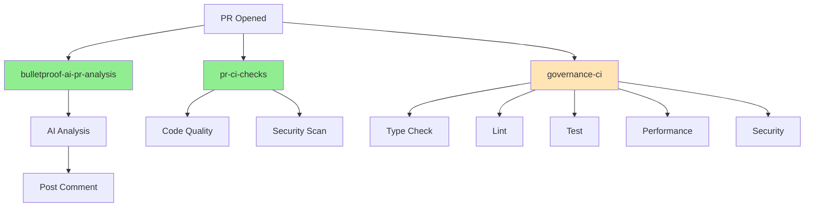
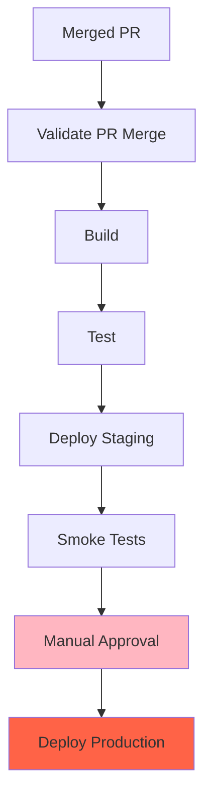

# Workflow Dependencies & Execution Order

## Overview

This document maps workflow dependencies, execution order, and coordination patterns across the AMAS GitHub Actions workflows.

## Dependency Types

### 1. Trigger Dependencies

Workflows triggered by the same event may run in parallel or sequence.

### 2. Data Dependencies

Workflows that depend on outputs from other workflows.

### 3. Resource Dependencies

Workflows that share resources (e.g., deployment environments).

### 4. Logical Dependencies

Workflows that must complete before others can proceed.

## PR Event Workflow Dependencies

### When PR is Opened to Main/Develop

```
PR Opened Event
    │
    ├─→ bulletproof-ai-pr-analysis.yml (Parallel)
    │   └─→ Posts analysis comment
    │
    ├─→ ai_pr_analyzer.yml (Parallel) [REDUNDANT - Should be disabled]
    │   └─→ Posts analysis comment
    │
    ├─→ real-ai-analysis.yml (Parallel) [REDUNDANT - Should be disabled]
    │   └─→ Validates real AI
    │
    ├─→ pr-ci-checks.yml (Parallel)
    │   ├─→ code-quality job
    │   └─→ security-scan job
    │
    └─→ governance-ci.yml (Conditional - Only if governance files changed)
        ├─→ type-check job (Parallel)
        ├─→ lint job (Parallel)
        ├─→ test job (Parallel)
        ├─→ performance job (Parallel)
        └─→ security job (Parallel)
```

**Execution Characteristics:**
- **Parallel Execution**: All workflows run simultaneously
- **No Blocking**: Workflows don't wait for each other
- **Independent**: Each workflow is self-contained

### When PR is Synchronized (New Commit)

Same as PR opened, but workflows may be cancelled if concurrency is enabled.

## Push Event Workflow Dependencies

### Push to Main Branch

```
Push to Main
    │
    ├─→ production-cicd.yml
    │   ├─→ build job
    │   ├─→ test job (depends on build)
    │   └─→ deploy job (depends on test)
    │
    ├─→ progressive-delivery.yml (If paths match)
    │   ├─→ validate-pr-merge job
    │   ├─→ build job (depends on validate)
    │   ├─→ test job (depends on build)
    │   └─→ deploy job (depends on test)
    │
    ├─→ deploy.yml
    │   └─→ deployment job
    │
    └─→ governance-ci.yml (If governance files changed)
        └─→ [Same as PR event]
```

**Execution Characteristics:**
- **Sequential Jobs**: Build → Test → Deploy
- **Parallel Workflows**: Multiple workflows may run
- **Conditional**: Some workflows only on path changes

## Scheduled Workflow Dependencies

### Daily/Periodic Workflows

```
Schedule Trigger
    │
    ├─→ 00-master-ai-orchestrator.yml (Every 6 hours)
    │   └─→ Coordinates other AI workflows
    │
    ├─→ 04-ai-enhanced-build-deploy.yml (Every 12 hours)
    │   └─→ Build and deploy if needed
    │
    ├─→ 07-ai-enhanced-cicd-pipeline.yml (Every 8 hours)
    │   └─→ CI/CD pipeline maintenance
    │
    ├─→ 05-ai-security-threat-intelligence.yml (Every 2 hours)
    │   └─→ Security monitoring
    │
    └─→ comprehensive-audit.yml (Weekly - Monday 2AM)
        └─→ Comprehensive system audit
```

**Execution Characteristics:**
- **Independent**: No dependencies between scheduled workflows
- **Overlapping**: Multiple workflows may run simultaneously
- **Resource Contention**: May compete for resources

## Deployment Workflow Dependencies

### Production Deployment Flow

```
Merged PR to Main
    │
    └─→ progressive-delivery.yml
        │
        ├─→ validate-pr-merge (Step 1)
        │   └─→ Verifies PR was merged (not direct push)
        │
        ├─→ build (Step 2 - depends on validate)
        │   └─→ Builds application
        │
        ├─→ test (Step 3 - depends on build)
        │   └─→ Runs tests
        │
        ├─→ deploy-staging (Step 4 - depends on test)
        │   └─→ Deploys to staging
        │
        ├─→ smoke-tests (Step 5 - depends on deploy-staging)
        │   └─→ Validates staging deployment
        │
        └─→ deploy-production (Step 6 - depends on smoke-tests)
            └─→ Requires manual approval
            └─→ Deploys to production
```

**Dependency Chain:**
1. validate → build → test → deploy-staging → smoke-tests → deploy-production
2. Each step depends on previous step success
3. Manual approval required for production

## AI Orchestration Dependencies

### Master AI Orchestrator Flow

```
00-master-ai-orchestrator.yml
    │
    ├─→ Analyzes project state
    │
    ├─→ Coordinates with:
    │   ├─→ 01-ai-agentic-project-self-improver.yml
    │   ├─→ 02-ai-agentic-issue-auto-responder.yml
    │   ├─→ 03-ai-agent-project-audit-documentation.yml
    │   ├─→ 05-ai-security-threat-intelligence.yml
    │   └─→ 06-ai-code-quality-performance.yml
    │
    └─→ Aggregates results
```

**Coordination Pattern:**
- **Orchestrator**: Coordinates but doesn't block
- **Agents**: Run independently
- **Results**: Aggregated by orchestrator

## Workflow Call Dependencies

### Reusable Workflows

**Current State:**
- No `workflow_call` workflows found
- All workflows are independent

**Opportunity:**
Create reusable workflows for common patterns:

```yaml
# .github/workflows/reusable-build.yml
on:
  workflow_call:
    inputs:
      python-version:
        required: true
        type: string

jobs:
  build:
    runs-on: ubuntu-latest
    steps:
      - uses: actions/checkout@v4
      - uses: actions/setup-python@v5
        with:
          python-version: ${{ inputs.python-version }}
```

**Benefits:**
- Code reuse
- Consistent behavior
- Easier maintenance

## Dependency Visualization

### PR Analysis Dependencies



### Deployment Dependencies



## Dependency Management Best Practices

### 1. Minimize Dependencies

**Best Practice:**
- Keep workflows independent when possible
- Use parallel execution
- Avoid blocking dependencies

**Current State:**
- ✅ Most workflows are independent
- ✅ Good parallel execution
- ⚠️ Some redundant workflows

### 2. Clear Dependency Chains

**Best Practice:**
- Use `needs:` for job dependencies
- Document workflow dependencies
- Make dependencies explicit

**Current State:**
- ✅ Good use of `needs:`
- ⚠️ Documentation could be better
- ✅ Dependencies are explicit

### 3. Failure Handling

**Best Practice:**
- Use `fail-fast: false` for parallel jobs
- Continue on non-critical failures
- Aggregate results

**Current State:**
- ✅ `fail-fast: false` used
- ✅ Good error handling
- ✅ Results aggregation

### 4. Resource Management

**Best Practice:**
- Avoid resource contention
- Use concurrency control
- Coordinate deployments

**Current State:**
- ✅ Concurrency control used
- ⚠️ Some resource contention possible
- ✅ Deployment coordination

## Recommendations

### 1. Create Reusable Workflows

**Action:**
- Extract common patterns
- Create `workflow_call` workflows
- Reuse across workflows

**Benefits:**
- Code reuse
- Consistency
- Easier maintenance

### 2. Document Dependencies

**Action:**
- Add dependency diagrams
- Document execution order
- Explain coordination patterns

**Benefits:**
- Better understanding
- Easier debugging
- Clearer architecture

### 3. Optimize Dependency Chains

**Action:**
- Review sequential dependencies
- Parallelize where possible
- Minimize blocking

**Benefits:**
- Faster execution
- Better resource utilization
- Improved feedback time

## Conclusion

**Current State:**
- ✅ Good independence between workflows
- ✅ Proper job dependencies
- ✅ Parallel execution where appropriate
- ⚠️ Some redundant workflows
- ⚠️ Missing reusable workflows

**Strengths:**
- Independent workflows
- Clear job dependencies
- Good parallelization

**Improvements:**
- Create reusable workflows
- Better documentation
- Optimize dependency chains
